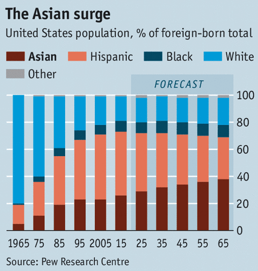

class: inverse

```{r setup, include=FALSE}
knitr::opts_chunk$set(
	message = FALSE,
	warning = FALSE
)
options(htmltools.preserve.raw = FALSE)
library(tidyverse)
recent_grads <- read_csv("https://raw.githubusercontent.com/fivethirtyeight/data/master/college-majors/recent-grads.csv") 

grad_data <- recent_grads %>%
  group_by(Major_category) %>%
  summarize(Men = mean(Men),
            Women = mean(Women),
            Overall = mean(Total)) %>%
  filter(Major_category %in% c("Business", "Education", "Engineering"))
```

```{css, echo = FALSE}
.pull-left-margin {
  float: left;
  width: 47%;
  margin-right: 50px;
}

.remark-code { /*Change made here*/
  font-size: 70% !important;
}
```

# Today's Agenda

- Reading Discussion
- Data Ink
- `ggplot` Anatomy
- Modifying Themes Practice
- Good Plot/Bad Plot

---
# Reading Discussion


1. What are several good rules of thumb when it comes to creating legends? (Refer to the text, if you can.)
2. Why does Wilke use the terms redundant "coding"?

---

# Reading Discussion

.pull-left[

The chart on the right is neither wonderful nor terrible.

Based on the readings from this week and prior discussions, what principles of good visualization does this chart exhibit? What principles does it violate?

How would you improve this chart?
]

.pull-right[


] 
---
# Data Ink

One interesting concept in data visualization is the concept of **data ink**, devised by William Tufte. From the [Infovis Wiki](https://infovis-wiki.net/wiki/Data-Ink_Ratio):

> Tufte refers to data-ink as the **non-erasable ink** used for the presentation of data. If data-ink would be removed from the image, the graphic would lose the content. 

> Non-Data-Ink is accordingly the ink that does not transport the information but it is used for **scales, labels and edges**. 

> The data-ink ratio is the proportion of Ink that is used to present actual data compared to the total amount of ink (or pixels) used in the entire display. (Ratio of Data-Ink to non-Data-Ink).

---
# Data Ink

Which chart would you consider better?

.pull-left[
## A


]

.pull-right[
## B

]
---
# Data Ink

Which chart would you consider better?

.pull-left[
## Low Data-Ink Ratio

This graph has a lot of non-data ink: background, grid lines, border, etc.


]

.pull-right[
## High Data-Ink Ratio

This graph has more data than non-data, i.e. the data is the focus and the other elements aid in understanding the data.


]
---
# Data Ink

## This weeks focus is non-data ink.

Non-data ink refers to the content that supports the data but does not deliver the quantitative information itself: background, grid lines, ticks, labels, legends, etc.

---
# `ggplot` Anatomy

.pull-left[
Recall that a plot made with `ggplot` is composed of numerous layers - all elements that make up the theme. And, we link these layers using `+`.

]

.pull-right[


]
---

# `ggplot` **THEME** Anatomy

.pull-left[

```{r fig.height=3}
p <- grad_data %>%
  ggplot(aes(x=Overall, y=Major_category, fill=Major_category))+
  geom_col()

p
```


]

.pull-right[

```{r fig.height=3}
p +
  theme(axis.text.x = element_text(size=5),
        axis.text.y = element_text(size=10),
        legend.background = element_rect(fill="blue"),
        axis.ticks = element_line(color="red"))

p
```
]
---
# `ggplot` **THEME** Anatomy

We have already seen that we can modify labels and text using `geom_text()` and `labs()`. We can also use `scale_*_continuous(labels=scales::comma_format()` or similar to control how continuous labels look.

Other important elements  can be easily manipulated using `theme()`


---
# `ggplot` **THEME** Anatomy

When we modify a theme, we specify the element name, e.g., `axis.text` or `axis.text.x` or `axis.text.y` (what do you think these modify?). 

Then, we specify the element function, e.g., if it is a text element, we will call it `element_text()`. If it is a rectangular element, we use `element_rect()`. If we want to remove something, we can use `element_blank()`

Inside of the function, we can specify colors (for lines and text), fill for rectangles, font size, font face, font family, text angle, etc. Here is an example:

---
# `ggplot` **THEME** Anatomy

```{r fig.height=5}
p +
  ggtitle("Plot title")+
  theme(axis.text.y = element_text(size=10,
                                   face="bold",
                                   angle=60,
                                   color="pink",
                                   margin=margin(r=50)),
        plot.title = element_text(size=20, face="italic"),
        axis.title = element_blank())
```

---
class: inverse

# Modifying Themes Practice
.pull-left[
### Today, you will be provided with data, a simple plot, a list of resources, and a target plot.

#### Your task will be to use the data and resources to transform the plot into the target.
]

.pull-right[


]

---

# Assignment: **Bad Plot/Good Plot**

.pull-left[

You will use **any** past data sets to design two plots. One will be a **good plot**: a beautiful masterpiece with excellent color choices and styled non-data ink. The other will be a **bad plot**: a disasterpiece eyesore with geoms, colors, and theme elements from the nethwerworld. 

The purpose of this assignment is to learn how to manipulate all elements of ggplot, for better or for worse.

> Credit: We got the idea for badplot from UT's own Dr. Drew Steen (Microbiology)

<!-- Note to teacher: it might be worth going through these tweets to see what ggplot is capable of, for better or for worse -->

Check out #badplot on Twitter:
[1](https://twitter.com/drdrewsteen/status/1593728366133190656),
[2](https://twitter.com/GeoffZahn/status/1445159932282617856)

]

.pull-right[
Bad Plot Example


]

---

# Mini Project 2

What questions do you have? What concerns do you have?

---
# Reading


Cairo (2019), Chapter 2

Wilke (2019), Chapter 13 