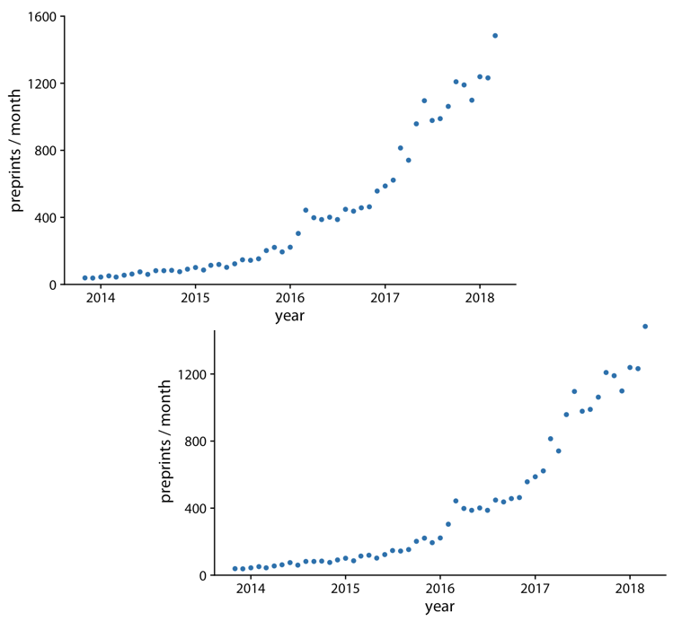
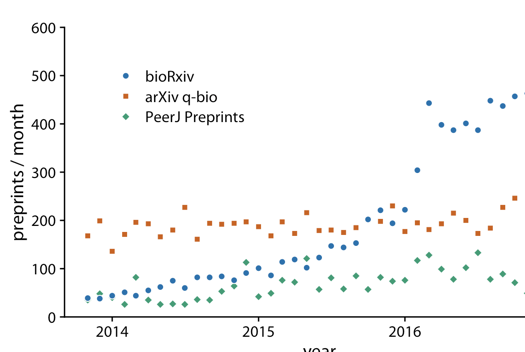

class: inverse

```{r setup, include=FALSE}
knitr::opts_chunk$set(
	message = FALSE,
	warning = FALSE,
	dev = "ragg_png"
)
options(htmltools.preserve.raw = FALSE)
library(tidyverse)
```

```{css, echo = FALSE}
.pull-left-margin {
  float: left;
  width: 47%;
  margin-right: 50px;
}

.remark-code { /*Change made here*/
  font-size: 70% !important;
}
```

# Today's Agenda

- Data Jam
- Reading Discussion
- Time**lines**
- Highlighter Activity
- Final Project

---
class:middle,center

# Data Jam

https://jamboard.google.com/d/1Xu73OGA5shTjwQiKOqWazzJT0_1jv28F4rhnd6f5Ln0/edit?usp=sharing

---

# Mini Project 1 Feedback

Examples: https://docs.google.com/presentation/d/1aPUVXaiZ8hjGJtWN6euxKstwcQI6zx0TSfBa9H642Sc/edit?usp=sharing

Overall feedback: Excellent work!

Process: Revise and resubmit to receive up to full credit (minus 10 points)

---

# Reading Discussion

How could this chart be improved?



---

# Reading Discussion

Which of the four charts below are effective? Why?


---

# Reading Discussion

How could this chart be improved?



---
# Time**lines**

Today we are going to talk about timeseries data and how to make time**lines** - line charts - from them. 
In addition, we will look at how to make area charts and how to make line charts when there are multiple groups, using a special package called `gghighlight`.

---
# Time**lines**

Consider that we already know how to graph timeseries data with `geom_col()` and `geom_point`:

```{r include=FALSE}
data <- data.frame(y=c(4.8,5.1,4.9,4.8,5.2,5.2,5.3,5.4,5.1,5.5)*10000, x=seq(2010,2019,1)) 
```

.pull-left[
```{r, fig.height=3}
data %>%
  ggplot(aes(x=as.factor(x), y=y))+
  geom_col()
```

]

.pull-right[
```{r, fig.height=3}
data %>%
  ggplot(aes(x=as.factor(x), y=y))+
  geom_point()
```

]

---
# Time**lines**

Can you guess how to make a line chart?

--

```{r, fig.height=3}
data %>%
  ggplot(aes(x=as.factor(x), y=y))+
  geom_line()
```

---
---
# Time**lines**

Hmmm. Notice that `x` is wrapped in `as.factor()`? This is because `x` is numeric. If we treat it numerically, we would get some non-date like axis labels:

--

.pull-left[
Note the ".5"'s on the x-axis.
```{r, fig.height=3}
data %>%
  ggplot(aes(x=x, y=y))+
  geom_line()
```
]

.pull-right[
Note the addition of `group=1`
```{r, fig.height=3}
data %>%
  ggplot(aes(x=as.factor(x), y=y, group=1))+
  geom_line()
```

]

---
# Time**lines**

How could we add points to this timeline?  
Hint: Remember, ggplots are built in layers:

--

Voila!

```{r, fig.height=3}
data %>%
  ggplot(aes(x=as.factor(x), y=y, group=1))+
  geom_line()+
  geom_point()
```

---
# Time**lines**

We can easily make this into an area chart, too. However, note that `geom_area` acts like a rectangle or polygon - it uses the fill aesthetic *AND* it starts at a zero baseline

.pull-left[

```{r, fig.height=3}
data %>%
  ggplot(aes(x=as.factor(x), y=y, group=1))+
  geom_area()+
  geom_point()
```

]

.pull-right[
```{r, fig.height=3}
data %>%
  ggplot(aes(x=as.factor(x), y=y, group=1))+
  geom_line()+
  geom_area(alpha=.3)+ #note: adding this alpha may or may not display correctly - the area may dissappear
  coord_cartesian(ylim=c(45000,56000))

```
]

---
# Timelines With Multiple Groups

What if you have multiple groups and want to show multiple lines?  
If you do not have many lines, we can do the following:

```{r include=FALSE}
mg_data <- data.frame(y=c(seq(11,20,1), rev(seq(11,20,1))),
                      x=rep(seq(2010,2019,1),2),
                      groups=c(rep("A", 10), rep("Z", 10)))

```
.pull=left[
```{r}
mg_data
```

]

.pull-right[
```{r}
mg_data %>%
  ggplot(aes(x=x, y=y, color=groups))+
  geom_line(size=2)
```
]

---
# Timelines With Multiple Groups

What about many groups?

--

```{r echo=FALSE}
phd_field <- readr::read_csv("https://raw.githubusercontent.com/rfordatascience/tidytuesday/master/data/2019/2019-02-19/phd_by_field.csv")

phd_field %>%
  group_by(major_field, year) %>%
  summarize(n = sum(n_phds, na.rm=TRUE)) %>%
  ggplot(aes(x=as.factor(year),
             y=n,
             color=major_field))+
  geom_line(aes(group=major_field))
```

--

This doesn't seem right, does it?

---

How about this? It's not perfect - there are data viz principles to consider. But, we can do it.

```{r eval=FALSE, include=FALSE}
phd_field %>%
  group_by(major_field, year) %>%
  summarize(n = sum(n_phds, na.rm=TRUE)) %>%
  ungroup() %>%
  ggplot(aes(x=as.factor(year),
             y=n,
             color=major_field,
             group=major_field))+
  geom_line()+
  #gghighlight:: gghighlight(max(n) > 500)+
   gghighlight::gghighlight(n=1)+
   facet_wrap(~str_wrap(major_field,40))+
  theme(legend.position = "none",
        strip.text = element_text(size=8),
        strip.background = element_blank(),
        axis.text.x = element_text(angle=45))+
  labs(x=NULL, y=NULL)

ggsave(last_plot(), width=10, height=8, file="gghighlight_example.png")
```


```{r echo=FALSE, fig.height=6}
knitr::include_graphics("gghighlight_example.png")
```
---
class:inverse,middle,center

# Highlighter

We will work with the PhD Graduates data set and make different time-series charts, including one like the previous (but better)

---

# Check out

**Grading:**: Mini Project 2, Assignment 6, Week 10 In-class Activity

**To do**: Assignment 7: Highlighter (by Friday, April 14)

**Final project**: Minor change: Submit HTML

**STEM 680:** Mondays, 12:00 - 2:30 pm

*What's one thing you took away from today?*