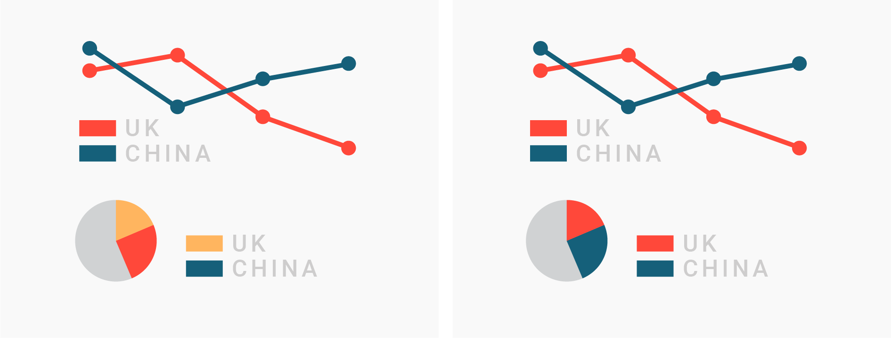
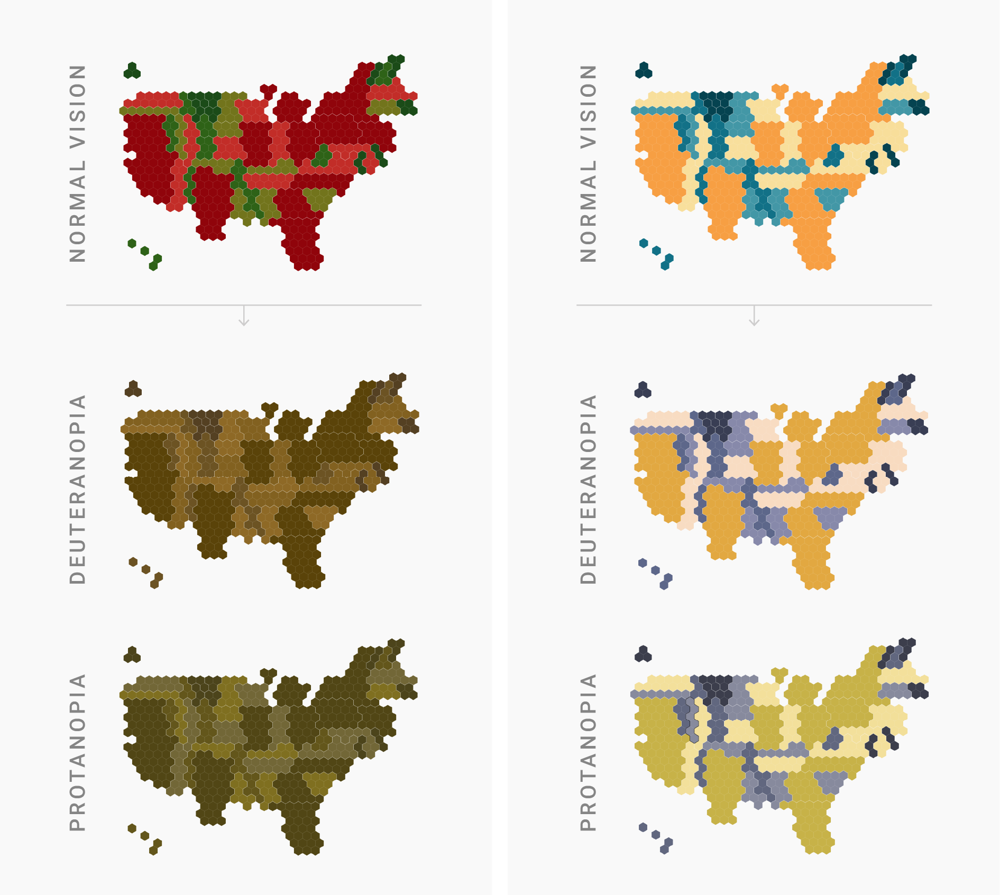

class: inverse

```{r setup, include=FALSE}
knitr::opts_chunk$set(
	message = FALSE,
	warning = FALSE
)
options(htmltools.preserve.raw = FALSE)
here::set_here()
library(tidyverse)
```

```{css, echo = FALSE}
.pull-left-margin {
  float: left;
  width: 47%;
  margin-right: 50px;
}

.remark-code { /*Change made here*/
  font-size: 70% !important;
}
```

# Today's Agenda

1. Data Jam
2. Reading Discussion
3. Introduction to Mini Project 1!
4. Building A Color Palette
5. Colors in ggplot
6. Next steps

---

class: inverse, center, middle
# 1. Data Jam

https://jamboard.google.com/d/1vK4SCkkV-5Fee68JY82jadELe5AFR5rhOUWdeUoa8PM/edit?usp=sharing

---

class: inverse, center, middle
# 2. Reading Discussion

---

# Reading Discussion

What are some primary considerations for choosing colors when designing data visualizations?

---

# Reading Discussion

Based on these considerations, which color choice do you think best communicates the story in the data?

<!-- Based on https://academy.datawrapper.de/article/140-what-to-consider-when-choosing-colors-for-data-visualization -->



<!-- Considerations: Colors should be consistent across visualizations -->

---

# Reading Discussion

Based on these considerations, which color choice do you think best communicates the story in the data?

<!-- Based on https://academy.datawrapper.de/article/140-what-to-consider-when-choosing-colors-for-data-visualization -->


---

# Reading Discussion

Based on these considerations, which color choice do you think best communicates the story in the data?

<!-- Based on https://academy.datawrapper.de/article/140-what-to-consider-when-choosing-colors-for-data-visualization -->


<!-- Considerations: Colors should match cultural expectations (good/bad),
the categories they represent (forest/lake) BUT not stereotype (female/male)
-->
---

# Reading Discussion

Based on these considerations, which color choice do you think best communicates the story in the data?

<!-- Based on https://academy.datawrapper.de/article/140-what-to-consider-when-choosing-colors-for-data-visualization -->


<!-- Considerations: Lower=lighter, more=darker.  -->

---

# Reading Discussion

Based on these considerations, which color choice do you think best communicates the story in the data?

<!-- Based on https://academy.datawrapper.de/article/140-what-to-consider-when-choosing-colors-for-data-visualization -->


<!-- Considerations: Distinct categories should have distinct colors.-->

---


# Reading Discussion

Based on these considerations, which color choice do you think best communicates the story in the data?

<!-- Based on https://academy.datawrapper.de/article/140-what-to-consider-when-choosing-colors-for-data-visualization -->


<!-- Considerations: Diverging colors should be distinct -->
---

# Reading Discussion

.pull-left[
Based on these considerations, which color choice do you think best communicates the story in the data?

<!-- Based on https://academy.datawrapper.de/article/140-what-to-consider-when-choosing-colors-for-data-visualization -->
]

.pull-right[



]
<!-- Considerations: Always consider different forms of visual perception -->

---
class: inverse, center, middle
# 3. Mini Project 1

## See **Mini Project 1.Rmd**
<!-- Go over assignment in document -->
---

class: inverse, center, middle
# Building a Color Palette

---

# Color Blindness Tools

.pull-left[
### Color Oracle is a free tool to help you quickly determine what your graphic looks like under different color blindness conditions

Download and install it from https://colororacle.org/ 

]

.pull-right[
Practice using it on this image:

]

---

# Colors in R

.pull-left[

Given our ability to 

1. Understand what is important in color selection **and**
2. Test whether our color choices are color blind friendly...

How can we use colors in R?
]

.pull-right[

- Base R colors
- Color Brewer
- Viridis
- Palette Packages
- Bespoke color palettes!

]

---
# Colors in R

## Base R Colors

R comes pre-loaded with 657 colors!

Use the command `colors()` to see all their names and visit http://www.stat.columbia.edu/~tzheng/files/Rcolor.pdf to see many of these colors.

---
# Colors in R
.pull-left[
## Using Base R Colors

You can simply use the name of the color in quotes.


```{r include=FALSE}
library(tidyverse)
set.seed(1983)
example_data <- data.frame(letters=LETTERS[1:5], numbers=sample(5:20, 5))
```


```{r echo=TRUE, eval=FALSE}
example_data %>%
  ggplot(aes(x=numbers, y=letters))+
  geom_col(fill="skyblue")+
  theme_void()
```
]

.pull-right[
```{r echo=FALSE, eval=TRUE}
example_data %>%
  ggplot(aes(x=numbers, y=letters))+
  geom_col(fill="skyblue")+
  theme_void()
```
]
---
# Colors in R
.pull-left[
## Using Base R Colors

You can simply use the name of the color in quotes.


```{r echo=TRUE, eval=FALSE}
example_data %>%
  ggplot(aes(x=numbers, y=letters, fill=letters))+
  geom_col()+
  scale_fill_manual(values=c("A" = "skyblue",
                             "B" = "sandybrown",
                             "C" = "palegreen1",
                             "D" = "peachpuff1",
                             "E" = "maroon"))+
  theme_void()
```


]

.pull-right[
```{r echo=FALSE, eval=TRUE}
example_data %>%
  ggplot(aes(x=numbers, y=letters, fill=letters))+
  geom_col()+
  scale_fill_manual(values=c("A" = "skyblue",
                             "B" = "sandybrown",
                             "C" = "palegreen1",
                             "D" = "peachpuff1",
                             "E" = "maroon"))+
  theme_void()
```
]
---
# Colors in R
## Using Base R Colors

This graph and the previous graph both use `fill`. What is the difference between the two usages?

.pull-left[
```{r echo=TRUE, eval=TRUE, fig.height=2}
example_data %>%
  ggplot(aes(x=numbers, y=letters))+
  geom_col(fill="skyblue")
```

]
.pull-right[
```{r echo=TRUE, eval=TRUE, fig.height=2}
example_data %>%
  ggplot(aes(x=numbers, y=letters, fill=letters))+
  geom_col()
```
]
---
# Colors in R
## Using Base R Colors

This graph and the previous graph both use `fill`. What is the difference between the two usages?

.pull-left[
```{r echo=TRUE, eval=TRUE, fig.height=2}
example_data %>%
  ggplot(aes(x=numbers, y=letters))+
  geom_col(fill="skyblue")
```

This maps the color to the `geom`etry - simply applying it to *all* the shapes.
]
.pull-right[
```{r echo=TRUE, eval=TRUE, fig.height=2}
example_data %>%
  ggplot(aes(x=numbers, y=letters, fill=letters))+
  geom_col()
```
This maps the color to the *data*.
]
---

# Colors in R
.pull-left[
## Using Base R Colors

`scale_fill_manual()` allows you to manually select the `fill` colors.  

Here, we are setting the values using a **named vector.**. `c()` creates a vector where the name "A" is equal to "skyblue" and so on.


```{r echo=TRUE, eval=FALSE}
  scale_fill_manual(values=c("A" = "skyblue",
                             "B" = "sandybrown",
                             "C" = "palegreen1",
                             "D" = "peachpuff1",
                             "E" = "maroon"))
```

Note: a vector is similar to a single `c`olumn of data in a table.

]

.pull-right[
```{r echo=FALSE, eval=TRUE}
example_data %>%
  ggplot(aes(x=numbers, y=letters, fill=letters))+
  geom_col()+
  scale_fill_manual(values=c("A" = "skyblue",
                             "B" = "sandybrown",
                             "C" = "palegreen1",
                             "D" = "peachpuff1",
                             "E" = "maroon"))+
  theme_void()
```
]
---

class: inverse, center, middle
# DIY Color Palette

Access the **Week 4 - Color Activities.Rmd** file.  
Let's work together to build a custom palette!

<!-- Note 1: This was designed to be a whole class activity 
It can be code along-style

Note 2: It is more than likely this could be assigned as homework and continued in next class
-->


### What are other options besides base R colors?


.pull-left[

One popular functions that come with `ggplot` is

`scale_*_brewer` 

Note that * refers to either `fill` or `color`.

- `fill` is usually used with `geom_col`, `geom_bar`, `geom_area`, `geom_tile`
- `color` is usually used with `gome_point` and `geom_line`
]

.pull-right[
 **Qualitative Palette**

```{r fig.height=2}
example_data %>%
  ggplot(aes(x=numbers, y=letters, fill=letters))+
  geom_col()+
  scale_fill_brewer(type="qual", palette = "Accent")
```

Other palette options include: Dark2, Paired, Pastel1, Pastel2, Set1, Set2, Set3
]
---

.pull-left[
 **Sequential Palette**

```{r fig.height=2}
example_data %>%
  ggplot(aes(x=numbers, y=letters, fill=letters))+
  geom_col()+
  scale_fill_brewer(type="seq", palette = "BuGn", direction=-1)
```

Other colors include: Blues, BuPu, GnBu, Greens, Greys, Oranges, OrRd, PuBu, PuBuGn, PuRd, Purples, RdPu, Reds, YlGn, YlGnBu, YlOrBr, YlOrRd
]

.pull-right[
 **Diverging Palette**

```{r fig.height=2}
example_data %>%
  ggplot(aes(x=numbers, y=letters, fill=letters))+
  geom_col()+
  scale_fill_brewer(type="div", palette="PiYG")
```
Other palettes include: BrBG, PRGn, PuOr, RdBu, RdGy, RdYlBu, RdYlGn, Spectral
]

---

## Next steps