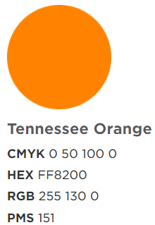

class: inverse

```{r setup, include=FALSE}
knitr::opts_chunk$set(
	message = FALSE,
	warning = FALSE
)
options(htmltools.preserve.raw = FALSE)
library(tidyverse)
```

```{css, echo = FALSE}
.pull-left-margin {
  float: left;
  width: 47%;
  margin-right: 50px;
}

.remark-code { /*Change made here*/
  font-size: 70% !important;
}
```
<!-- Note: Week 4 contains several activities and can be split between Weeks 4 and 5 -->

# Today's Agenda

1. Data Jam
2. Reading Discussion
3. Introduction to Mini Project 1!
4. Building A Color Palette
5. Colors in ggplot
6. Next steps

---
class: inverse, center, middle
# Data Jam

https://jamboard.google.com/d/1vK4SCkkV-5Fee68JY82jadELe5AFR5rhOUWdeUoa8PM/edit?usp=sharing

class: middle, center

---

### What are other options besides base R colors?

.pull-left[
Another set of more advanced options installed with `ggplot` include:


- `scale_*_viridis_c` - used for continuous data
- `scale_*_viridis_d` - used for discrete data


]

.pull-right[

```{r, fig.height=4}
txsamp <- subset(txhousing, city %in%
  c("Houston", "Fort Worth", "San Antonio", "Dallas", "Austin"))
d <- ggplot(data = txsamp, aes(x = sales, y = median)) +
   geom_point(aes(colour = city), size=3)

d + scale_colour_viridis_d()
```
See [documentation](https://ggplot2.tidyverse.org/reference/scale_viridis.html) for other color options

]

---

### What are other options besides base R colors?


You can install and use other color packages such as `tvthemes`, `hrbrthemes`,  `ghibli`, or even `LaCroixColoR`. See 

See https://github.com/EmilHvitfeldt/r-color-palettes/blob/master/type-sorted-palettes.md for a list of R color packages


---

# DIY Color Palette

Today, we are going to build our own UTK color palette.

Before we do that, however, let's learn a bit more about R data structures

So far, we have mostly been working with **data frames**. A data frame is basically a table. It is made up of columns and rows. 

Here is a 5x6 data frame. It is made up of 5 rows and 6 columns.

```{r, echo=FALSE}
library(tidykids)
tidykids <- tidykids %>%
  filter(variable == "PK12ed",
         year==2006)

as.data.frame(head(tidykids, 5))
```

---

A single column of data is known as a **vector**.

```{r}
tidykids$state
```

---
A vector may be a **character vector**, or it may be a **numeric vector**. A vector is never a mix of the two.

```{r}
tidykids$raw
```


---
A character or numeric vector may also be **named**. Each element in the vector has a name. We saw this example with `scale_fill_manual`:

```{r}
c("A"  = "skyblue",
   "B" = "sandybrown",
   "C" = "palegreen1",
   "D" = "peachpuff1",
   "E" = "maroon")

```


---
Other common data structures include

**matrices**

```{r}
m <-  matrix(
  c(4, 4, 4, 4),
  nrow = 2,
  ncol = 2)
m
```


**lists**

```{r}
x <- list(1, "a", TRUE, 1+4i)
x
```

---

# DIY Color Palette

.pull-left[

Let's explore the UTK brand color guidelines and use the information to build a UTK color palette. We will build a data frame (for practice) and then a character vector (for use). They will be quite similar.

Navigate to [this archive of the UTK color guidelines](https://web.archive.org/web/20210224024222/https://brand.utk.edu/standards/colors/).

(*Note*: The [current UTK color guidelines](https://brand.utk.edu/standards/colors/#:~:text=Using%20our%20signature%20color%20brings,allow%20our%20orange%20to%20shine) have removed the accent colors so we are accessing them via the Wayback machine, which archives snapshots of websites.)

]

.pull-right[

You will see color swatches like this:


]
---
# DIY Color Palette

.pull-left[

- **CMYK** - Cyan, Magenta, Yellow, Key - used in color printing
- **HEX** - 6-character alphanumeric color reference used in software and web design. All hex value should begin with a hashtag: *#FF8200*
- **RGB** - Red, Green, Blue - a set of 3 numbers (0-250) to denote a color, used in software and web design
- **PMS** - Pantone Matching System - a *proprietary* color system

### Hex values are the easiest to work with!
]

.pull-right[


You will see color swatches like this:


]

---

class: inverse, center, middle

# Data Viz Tear Down

Run the code at the bottom of **Week 5 - Color Activities.Rmd**

Be ready to answer the questions and discuss the different functions and plots.

---
# Weekly Assignment 3: Data Viz Glow Up

Using our previous assignments, choose 1 visualization and redesign them to use some of the color principles and techniques we discussed.

The following represents assignment and grading criteria.

- ☐ Submit a new Rmd that you create from scratch. This must run when knitte.
- ☐ Do not use default ggplot colors. Use base R colors or a package.
- ☐ At least one of your plots must use a custom palette you develop.
- ☐ At least one of your plots must map the color to a numeric dimension.


---
# Readings

.pull-left[
**Read:**
Wilke (2019), Chapter 10  
Wilke (2019), Chapter 12  
]

.pull-right[
**Discussion Questions:**
1. What different types of visualizations use circles? When are they useful?
2. What are different ways to visualize parts of a whole?
]
