    
```{r setup, include=FALSE}
library(tidyverse) #includes starwars data set
library(gt)
```

# Weekly Check In, Download `.zip`, Download Slides

# Start Recording

## Today's Agenda {.smaller}
<hr>

- Weekly Check In
- Norms
- Intro to Quarto Files (.Qmd)
- Understanding Packages 
- {tidyverse} Introduction
- {palmerpenguins} Scavenger Hunt
- Looking Ahead

## Norms
<hr>

:::{.compact-font}
| In person norms | And also, for online learning... |
|----------|----------|
| Be fully present to each other & the work. | Keep your video on when possible. In large groups, mute your microphone when not talking. Close/mute/minimize other apps and devices to avoid distraction. |
| Assume positive intent & also take responsibility for the impact you have. | Remember online interaction masks even more of the full story. Notice when you are making assumptions, and seek information to check them. |
| Embrace collaboration. | Use the gallery view so you can see everyone. Use breakout groups as an opportunity to collaborate. |
| Be open to learning and accept non-closure. | Expect the inevitable technical glitches and learning curves. Exercise patience with one another. |
| Be aware of when to step up and step back. When stepping back, do so as an active listener. | Try out different modes of participation. Step back by making space for others to engage in these. |
| Land your plane--get to the point you intended. | We all know how hard it is to be talked at, especially in a Zoom session, so let's keep it to a minimum. |

:::

# Intro to Quarto Markdown (.qmd)<br>*File Type #2*

## Creating a Quarto Document {.smaller}
<hr>

:::{layout = "[30,70]"}

:::{column}
1. Create New File
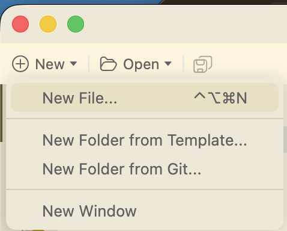
:::

:::{column}
2. Select "Quarto Document"
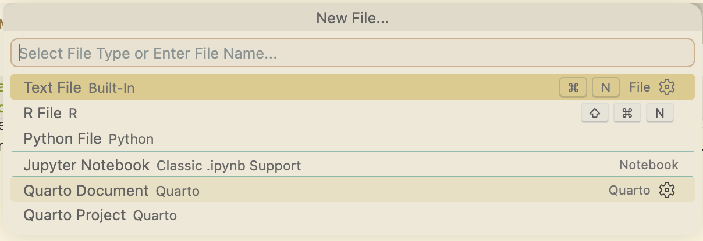
:::

:::
*Most of the time, a .qmd file will be provided for you in the .zip file.*

## Quarto Markdown Documents {.smaller}
<hr>
Components of a Quarto Markdown Document

:::{layout="[50,50]"}

:::{column}
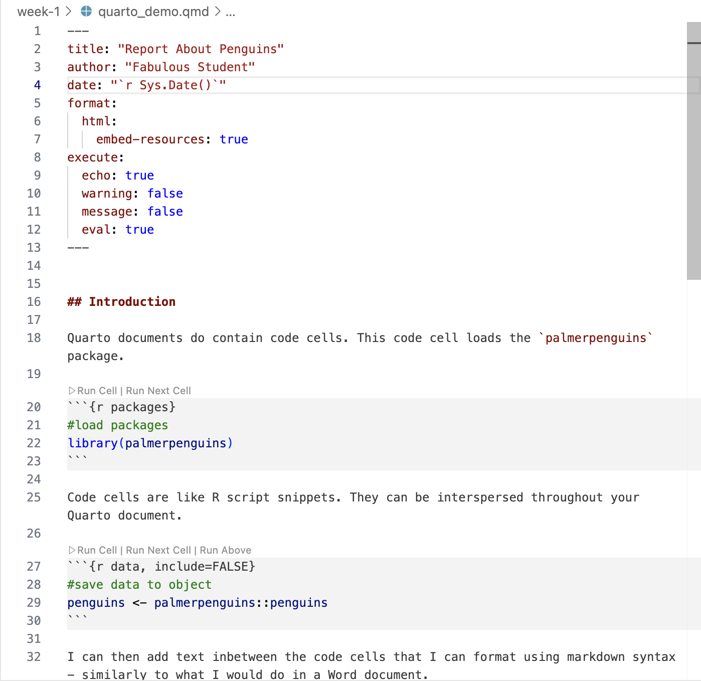
:::

:::{column}
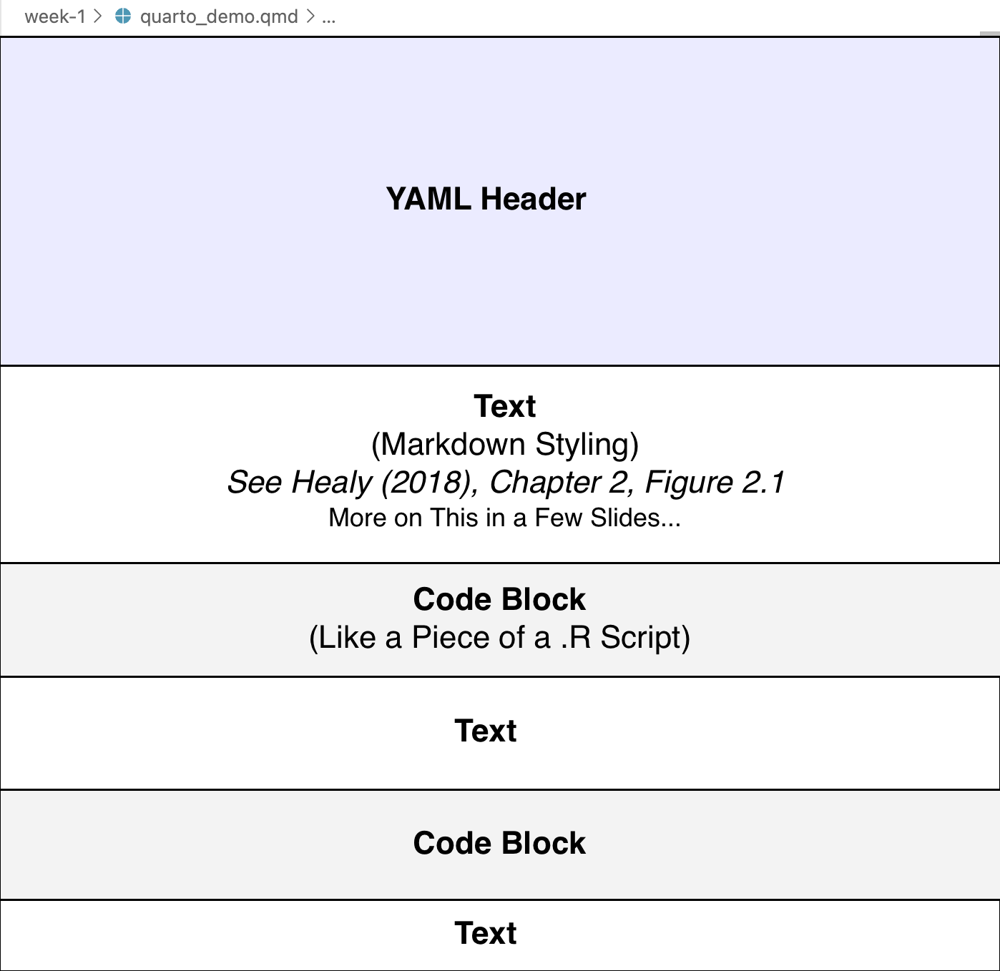{.fragment}
:::
:::

# YAML Header

## YAML Header
<hr>
- The YAML header is very sensitive

```r
---
title: "Untitled"
author: "Fabulous Student"
date: "`r Sys.Date()`"
format:
  html:
    embed-resources: true
execute:
    warning: false
    message: false
---
```
- Most documents have this already.
- If not, copy/paste above to a new Quarto Doc.

# How to Style Plain Text in .Qmd <br> *Markdown Formatting*

## Quarto - Plain Text (Markdown) {.smaller}
<hr>

In the plan text sections of a .qmd file, we can style text like you would in Microsoft Word - we just don't have the buttons to click!

:::{layout="[50,50]"}
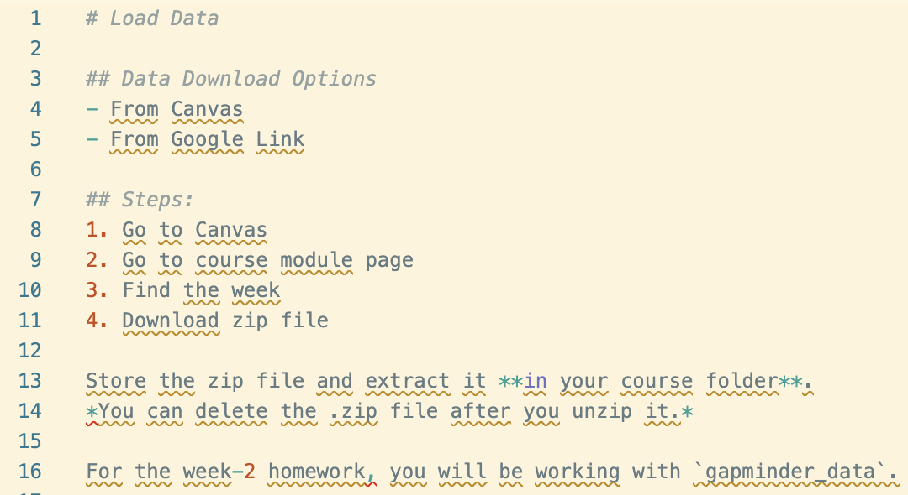<br>[An example text section in a `.qmd`]{.small-font}

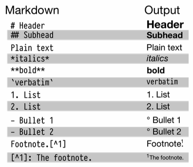<br>[Healy, Ch. 2, Figure 2.1]{.small-font}

:::

[- Note: verbatim formatting is created with backtick (tilde - next to #1) key, not single quotation]{.extra-small-font}

# Working with Code Cells in .Qmd

## Quarto - Code Cells (R){.smaller}
<hr>

- A final part of a Quarto Document is the **code cells**.
- You can insert a code cell by clicking this button in Positron (or by manually typing it what it generates):
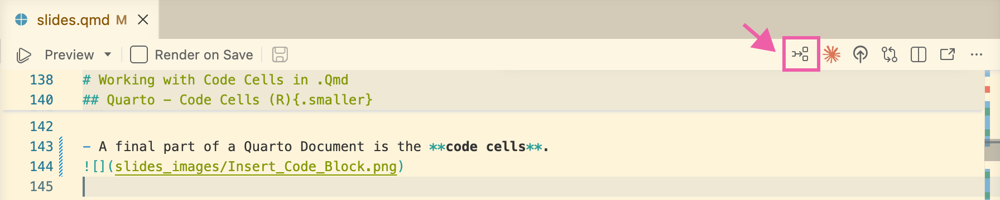

- This is a code cell in a .qmd document:
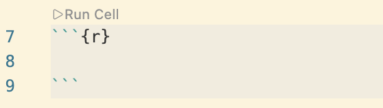

## Quarto - Code Cells (R){.smaller}
<hr>
Working in Code Cells:

:::{layout="[50,50]"}

:::{column}
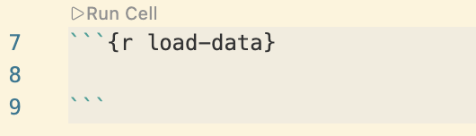
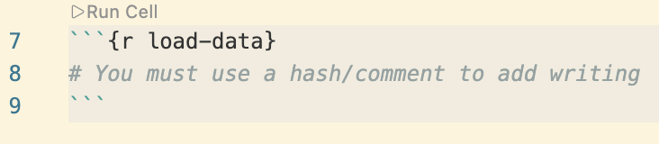
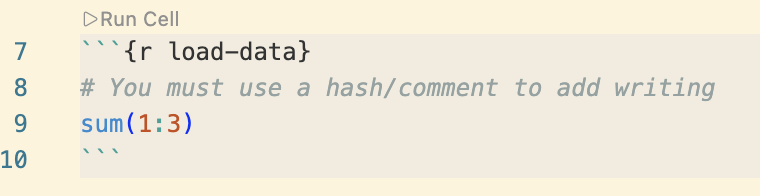
:::

:::{column}
- You can name the code cells (helpful when you have errors)
<br>
<br>
<br>
<br>
- To write regular text within the cell, you need to use comments with an `#`
<br>
<br>
- Then, of course, we write the actual R code in the cell.
:::

:::

## Quarto - Code Cells (R){.smaller}
<hr>
Running Code Cells:

:::{layout="[50,50]"}

:::{column}
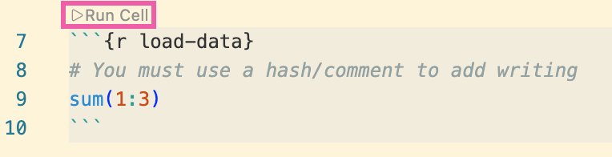
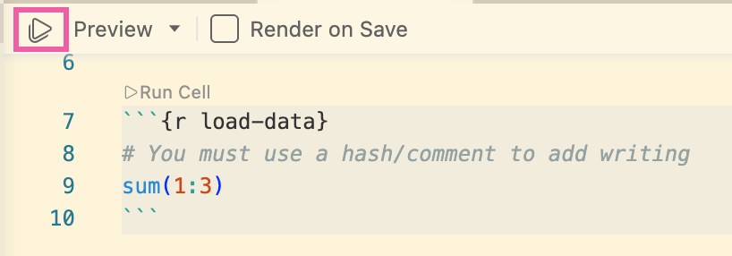
:::

:::{column}
- You can run code cells one-by-one. Note that this is a bit like a recipe, running them individually out-of-order can cause problems.
<br>
<br>
- You can also run all of the code in the file ("Run All"), which runs the cells in order.
:::

:::

## Quarto - Code Cells (R){.smaller}
<hr>

- You can use code cell options in the YAML header to establish code block defaults for the full document.
  - See the four parameters beneath "execute"

```r
title: "Example Quarto Document"
author: "Fabulous Student"
date: "`r Sys.Date()`"
format:
  html:
    embed-resources: true
execute:
  echo: true
  warning: false
  message: false
  eval: true
```

:::{.smaller-font}

- **echo**: Whether to show the code in the output document
- **warning**: Whether to show warnings in the output document
- **message**: Whether to print messages in the output document
- **eval**: Whether to run the code in the cell
:::

# Rendering Quarto Docs

## Rendering .qmds {.smaller}
<hr>
We don't just save and upload .qmd documents (like we have .R scripts). Instead, we "render" them to get a finished product—HTML, .docx, PDF, etc. We use HTML in this class. **I will often ask you to upload both the .html and .qmd files to Canvas.**

:::{layout="[50,50]"}

:::{column}

:::

:::{column}
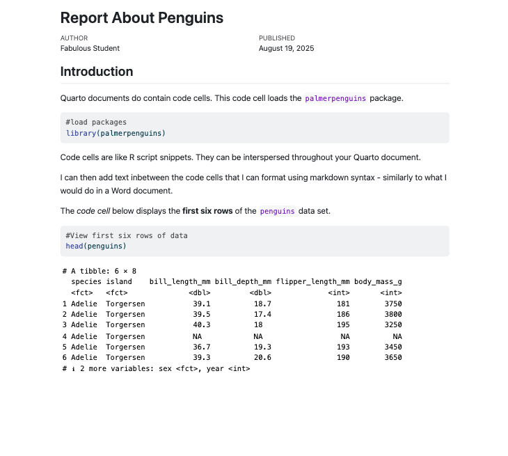
:::
:::

## Rendering .qmds {.smaller}
<hr>
Rendering Quarto Documents
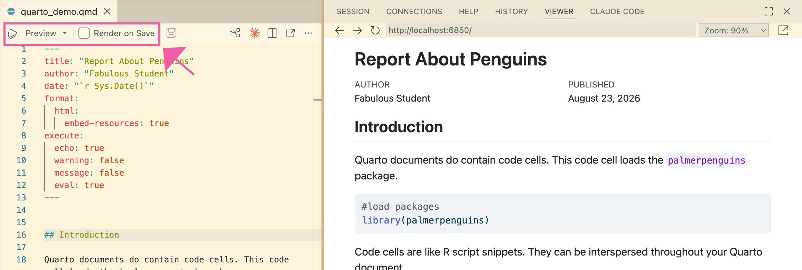

- You will end up with two files:
  - Original .qmd (editable)
  - Rendered Product: .html (or .docx, PDF, etc.)

## Rendering .qmds: Errors {.smaller}
<hr>
- When Quarto docs fail to render, it will tell you which cell the error is in:
  - Note: Earlier we had named this cell "load-data".

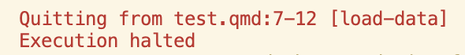<br>[Error in load-data cell, lines 7-12]{.small-font}


## Final Thoughts Re: Quarto {.smaller}
<hr>
- Most of your homework will be submitted as a Quarto Markdown files.
  - Starting this week...
- We focus on `.html` outputs from your Quarto documents because Canvas can read them and they support interactive plots, but you can also output to PDF and slides (like these), among other formats.

<!-- # Markdown Activity<br>*If Time Allows*

## Quarto Markdown - Plain Text - Activity {.smaller}
<hr>
*If time allows:*

- In Canvas you will find an activity called `Quarto Markdown: In-Class Activity`
- It should open up another page with instructions.
- In the `week-2` folder you will find the file for the activity called `Quarto_In_Class_Activity.qmd`.

## Takeaways from Activity {.smaller}
<hr>
- Markdown activity:
  - Markdown is sensitive to spacing
    - e.g., single spaces between dashes and words to make bullets
  - Quarto is sensitive to line spacing
    - e.g., If a bullet doesn't format and you've checked the markdown formatting, put a line break/return before you start the list
    - Make sure you have a blank line between the code block and your first line of text -->

# Welcome to the {tidyverse}

## Installing & Loading Packages {.smaller}
<hr>
##### Installing Packages
- You only install a package once on your computer (the first time you use it)
- Note: I do this in the console (aka scratchpad)
- Example: Downloading software from the internet to install on your computer
```r
install.packages("tidyverse")
```
##### Loading Packages
- Then, each time you want to use it you will need to load it from your package library
- Do this in your `.R` script or `.qmd` file itself (usually at the top)
- Example: Opening the installed software each time you want to use it
```r
library(tidyverse)
```

## {tidyverse} Intro {.smaller}
<hr>
- The *tidyverse* is a [collection of packages](https://tidyverse.org/packages/#core-tidyverse) for data science
  - The packages can be loaded separately, but just loading {tidyverse} installs eight core packages.
  - We'll largely focus on two:
    1. {dplyr} - data wrangling
    2. {ggplot2} - data viz

# {dplyr} Basics

## {dplyr} Basics
<hr>
- From Estrellado et al. (2020)
- **In chat:** What is a function?

```{r include=FALSE}
starwars <- starwars |>
  slice(1:5) |>
  select(1:5)
```

## {dplyr} Basic Functions
<hr>
`select()`
<br>
<hr>

::: {.columns .small-font}

::: {.column width="45%"}

**Example data – starwars**

```{r echo=FALSE}
starwars |>
  slice(1:5) |>
  select(name:skin_color) |>
  gt() |>
  tab_options(
    table.width = pct(100),
    table.font.size = px(13),
    data_row.padding = px(2)
  ) |>
  tab_style(
    style = cell_fill(color = "#f9f9f9"),
    locations = cells_body(rows = c(1, 3, 5))
  ) |>
  opt_table_lines(extent = "none")
```

:::

::: {.column style="border-left: 4px solid #FF8200; padding-left: 1em;"}

[`data |> select(var1, var2)`]{.fragment}

[- Use this to **select columns/variables**]{.fragment .extra-small-font}

:::{.fragment}
```{r}
starwars |>
  select(name, height)
```
:::

:::
:::


## {dplyr} Basic Functions
<hr>
`select()`
<br>
<hr>

::: {.columns .small-font}

::: {.column width="45%"}

**Example data – starwars**

```{r echo=FALSE}
starwars |>
  slice(1:5) |>
  select(name:skin_color) |>
  gt() |>
  tab_options(
    table.width = pct(100),
    table.font.size = px(13),
    data_row.padding = px(2)
  ) |>
  tab_style(
    style = cell_fill(color = "#f9f9f9"),
    locations = cells_body(rows = c(1, 3, 5))
  ) |>
  opt_table_lines(extent = "none")
```

:::

::: {.column style="border-left: 4px solid #FF8200; padding-left: 1em;"}

:::{.fragment}
`data |> select(var1, var2)` <br>
*or* <br>
`select(data, var1, var2)`
:::

[- **Note**: These are the same!]{.fragment .extra-small-font}

:::{.fragment}
```{r echo=TRUE, eval=FALSE}
starwars |>
  select(name, height)

select(starwars, name, height)
```
:::

:::
:::

# Why the same?

## {dplyr} Basic Functions
<hr>
Pipe Operator: `%>% or |>`
<hr>

[The pipe operator connects functions together into a *chain* of step-by-step commands. It can be translated as **and then**.]{.small-font}

::: {.columns .small-font}

::: {.column width="45%"}

```{r}
starwars |>
  select(name, height) |>
  glimpse()
```
:::
::: {.column style="border-left: 4px solid #FF8200; padding-left: 1em;"}
::::{.small-font}

*In English*:<br>

:::{.extra-small-font .incremental}
1. Take the starwars data set *and then*
2. `select` the name and height columns *and then*
3. `glimpse` the result in Positron
:::
:::
::::
:::

## Pipe Shortcut {.smaller}
<hr>
- There is a shortcut for the pipe operator
  - **Windows/Linux**: Ctrl + Shift + M
  - **Mac**: Cmd + Shift + M

## Pipe History {.smaller}
<hr>
- The original pipe was in {magrittr} `%>%`
  - Still used in a lot of documentation/books

- The new pipe is in base R `|>`
  - Now recommended for use
  - Positron shortcut defaults to it 

## {dplyr} Basic Functions
<hr>
`slice()`
<br>
<hr>

::: {.columns .small-font}

::: {.column width="45%"}

**Example data – starwars**

```{r echo=FALSE}
starwars |>
  slice(1:5) |>
  select(name:skin_color) |>
  gt() |>
  tab_options(
    table.width = pct(100),
    table.font.size = px(13),
    data_row.padding = px(2)
  ) |>
  tab_style(
    style = cell_fill(color = "#f9f9f9"),
    locations = cells_body(rows = c(1, 3, 5))
  ) |>
  opt_table_lines(extent = "none")
```

:::

::: {.column style="border-left: 4px solid #FF8200; padding-left: 1em;"}

:::{.fragment}
`data |> slice(3:5)`
:::

[- Use this to **select rows**]{.extra-small-font .fragment}
<br>

:::{.fragment .medium-small-font}
```{r}
starwars |>
  slice(3:5)
```
:::

:::
:::


## {dplyr} Basic Functions
<hr>
`filter()`
<br>
<hr>
::: {.columns .small-font}

::: {.column width="45%"}

**Example data – starwars**

```{r echo=FALSE}
starwars |>
  slice(1:5) |>
  select(name:skin_color) |>
  gt() |>
  tab_options(
    table.width = pct(100),
    table.font.size = px(13),
    data_row.padding = px(2)
  ) |>
  tab_style(
    style = cell_fill(color = "#f9f9f9"),
    locations = cells_body(rows = c(1, 3, 5))
  ) |>
  opt_table_lines(extent = "none")
```

:::

::: {.column style="border-left: 4px solid #FF8200; padding-left: 1em;"}

[`data |> filter(var >= 50)`]{.fragment}

[- Use this to **filter rows**]{.extra-small-font .fragment}
<br>

:::{.fragment .medium-small-font}

```{r}
starwars |>
  filter(mass >= 50)
```
:::

:::
:::

## {dplyr} Basic Functions
<hr>
`filter()`
<br>
<hr>

::: {.columns .small-font}

::: {.column width="45%"}

**Example data – starwars**

```{r echo=FALSE}
starwars |>
  slice(1:5) |>
  select(name:skin_color) |>
  gt() |>
  tab_options(
    table.width = pct(100),
    table.font.size = px(13),
    data_row.padding = px(2)
  ) |>
  tab_style(
    style = cell_fill(color = "#f9f9f9"),
    locations = cells_body(rows = c(1, 3, 5))
  ) |>
  opt_table_lines(extent = "none")
```
:::

::: {.column style="border-left: 4px solid #FF8200; padding-left: 1em;"}

[`data |> filter(var == "brown")`]{.fragment .medium-small-font}

[- Use this to **filter for/keep rows**]{.extra-small-font .fragment}

:::{.fragment .medium-small-font}
```{r}
starwars |>
  filter(hair_color == "brown")
```
:::

:::
:::

## {dplyr} Basic Functions
<hr>
`filter_out()`
<br>
<hr>

::: {.columns .small-font}

::: {.column width="45%"}

**Example data – starwars**

```{r echo=FALSE}
starwars |>
  slice(1:5) |>
  select(name:skin_color) |>
  gt() |>
  tab_options(
    table.width = pct(100),
    table.font.size = px(13),
    data_row.padding = px(2)
  ) |>
  tab_style(
    style = cell_fill(color = "#f9f9f9"),
    locations = cells_body(rows = c(1, 3, 5))
  ) |>
  opt_table_lines(extent = "none")
```
:::

::: {.column style="border-left: 4px solid #FF8200; padding-left: 1em;"}

[`data |> filter_out(var == "brown")`]{.fragment .medium-small-font}

[- Use this to **filter out rows**]{.extra-small-font .fragment}

:::{.fragment .medium-small-font}
```{r}
starwars |>
  filter_out(hair_color == "brown")
```
:::

:::
:::

## {dplyr} Basic Functions
<hr>
`filter()`
<br>
<hr>
::: {.columns .small-font}

::: {.column width="45%"}

**Example data – starwars**

```{r echo=FALSE}
starwars |>
  slice(1:5) |>
  select(name:skin_color) |>
  gt() |>
  tab_options(
    table.width = pct(100),
    table.font.size = px(13),
    data_row.padding = px(2)
  ) |>
  tab_style(
    style = cell_fill(color = "#f9f9f9"),
    locations = cells_body(rows = c(1, 3, 5))
  ) |>
  opt_table_lines(extent = "none")
```

:::

::: {.column style="border-left: 4px solid #FF8200; padding-left: 1em;"}

[`data |> filter(!is.na(var))`]{.fragment .medium-small-font}

[- Use this to **filter rows**]{.extra-small-font .fragment}

:::{.fragment .medium-small-font}
```{r}
starwars |>
  filter(!is.na(hair_color))
```
:::

:::
:::

## {dplyr} Basic Functions
<hr>
`filter_out()`
<br>
<hr>
::: {.columns .small-font}

::: {.column width="45%"}

**Example data – starwars**

```{r echo=FALSE}
starwars |>
  slice(1:5) |>
  select(name:skin_color) |>
  gt() |>
  tab_options(
    table.width = pct(100),
    table.font.size = px(13),
    data_row.padding = px(2)
  ) |>
  tab_style(
    style = cell_fill(color = "#f9f9f9"),
    locations = cells_body(rows = c(1, 3, 5))
  ) |>
  opt_table_lines(extent = "none")
```

:::

::: {.column style="border-left: 4px solid #FF8200; padding-left: 1em;"}

[`data |> filter_out(is.na(var))`]{.fragment .medium-small-font}

[- Use this to **filter rows**]{.extra-small-font .fragment}

:::{.fragment .medium-small-font}
```{r}
starwars |>
  filter_out(is.na(hair_color))
```
:::

:::
:::

## {dplyr} Basic Functions
<hr>
`str()`
<br>
<hr>

::: {.columns .small-font}

::: {.column width="45%"}

**Example data – starwars**

```{r echo=FALSE}
starwars |>
  slice(1:5) |>
  select(name:skin_color) |>
  gt() |>
  tab_options(
    table.width = pct(100),
    table.font.size = px(13),
    data_row.padding = px(2)
  ) |>
  tab_style(
    style = cell_fill(color = "#f9f9f9"),
    locations = cells_body(rows = c(1, 3, 5))
  ) |>
  opt_table_lines(extent = "none")
```

:::

::: {.column style="border-left: 4px solid #FF8200; padding-left: 1em;"}

[`str(data)`]{.fragment}

[- Use this to see the **structure** of an object]{.extra-small-font .fragment}

:::{.fragment .medium-small-font}

```{r}
str(starwars)
```
:::

:::
:::

## {dplyr} Basic Functions
<hr>
`head()`
<br>
<hr>
::: {.columns .small-font}

::: {.column width="45%"}

**Example data – starwars**

```{r echo=FALSE}
starwars |>
  slice(1:5) |>
  select(name:skin_color) |>
  gt() |>
  tab_options(
    table.width = pct(100),
    table.font.size = px(13),
    data_row.padding = px(2)
  ) |>
  tab_style(
    style = cell_fill(color = "#f9f9f9"),
    locations = cells_body(rows = c(1, 3, 5))
  ) |>
  opt_table_lines(extent = "none")
```

:::

::: {.column style="border-left: 4px solid #FF8200; padding-left: 1em;"}

[`head(data)`]{.fragment}

[- Use this to **see the first** ***n*** **rows** of an object]{.extra-small-font .fragment}
<br>

:::{.fragment .medium-small-font}

```{r}
head(starwars)

head(starwars, 2)
```
:::

:::
:::

## {dplyr} Basic Functions
<hr>
`rename()`
<br>
<hr>

::: {.columns .small-font}

::: {.column width="45%"}

**Example data – starwars**

```{r echo=FALSE}
starwars |>
  slice(1:5) |>
  select(name:skin_color) |>
  gt() |>
  tab_options(
    table.width = pct(100),
    table.font.size = px(13),
    data_row.padding = px(2)
  ) |>
  tab_style(
    style = cell_fill(color = "#f9f9f9"),
    locations = cells_body(rows = c(1, 3, 5))
  ) |>
  opt_table_lines(extent = "none")
```

:::

::: {.column style="border-left: 4px solid #FF8200; padding-left: 1em;"}


[`rename(new_var_name = old_var_name)`]{.fragment .medium-small-font}

[- Use this to **rename** a column]{.extra-small-font .fragment}
<br>

::::{.fragment .medium-small-font}
```{r}
starwars |>
  rename(weight = mass)
```
:::

:::

[-But reviewing starwars right after, it still says mass. Why?]{.fragment .medium-small-font}

:::{.fragment .medium-small-font}
```{r}
starwars
```
:::
:::

## {dplyr} Basic Functions
<hr>
`rename()`
<br>
<hr>
::: {.columns .small-font}

::: {.column width="45%"}

**Example data – starwars**

```{r echo=FALSE}
starwars |>
  slice(1:5) |>
  select(name:skin_color) |>
  gt() |>
  tab_options(
    table.width = pct(100),
    table.font.size = px(13),
    data_row.padding = px(2)
  ) |>
  tab_style(
    style = cell_fill(color = "#f9f9f9"),
    locations = cells_body(rows = c(1, 3, 5))
  ) |>
  opt_table_lines(extent = "none")
```

:::

::: {.column style="border-left: 4px solid #FF8200; padding-left: 1em;"}

[`rename(new_var_name = old_var_name)`]{.fragment .medium-small-font}

[- You need to assign the changes to keep them!]{.extra-small-font .fragment}

::::{.fragment .medium-small-font}
```{r}
renamed_starwars <- starwars |>
  rename(weight = mass)

# starwars <- starwars |>
#   rename(weight = mass)

renamed_starwars
```
:::

:::
:::

## {dplyr} Basic Functions
<hr>
`mutate()`
<br>
<hr>
::: {.columns .small-font}

::: {.column width="45%"}

**Example data – starwars**

```{r echo=FALSE}
starwars |>
  slice(1:5) |>
  select(name:skin_color) |>
  gt() |>
  tab_options(
    table.width = pct(100),
    table.font.size = px(13),
    data_row.padding = px(2)
  ) |>
  tab_style(
    style = cell_fill(color = "#f9f9f9"),
    locations = cells_body(rows = c(1, 3, 5))
  ) |>
  opt_table_lines(extent = "none")
```

:::

::: {.column style="border-left: 4px solid #FF8200; padding-left: 1em;"}

[`mutate()` A Challenge!]{.fragment}

:::{.medium-small-font .fragment}
1. How many columns do we expect?
2. What does each line do?
3. Can we simplify it?
:::

:::
:::
:::{.fragment .small-font}
<br>
```{r eval=F}
starwars |>
  mutate(one = height^2) |>
  mutate(two = height * mass) |>
  mutate(hair_color = ifelse(is.na(hair_color), "unknown", hair_color))
```
:::

## {dplyr} Basic Functions
<hr>
`mutate()`
<br>
<hr>

[`mutate()` A Challenge!]{.fragment}
<br>
<br>

:::{.fragment .small-font}
```{r eval=T}
starwars |>
  mutate(one = height^2) |>
  mutate(two = height * mass) |>
  mutate(hair_color = ifelse(is.na(hair_color), "unknown", hair_color))
```
:::

## {dplyr} Basic Functions
<hr>
`mutate()`
<br>
<hr>

`mutate()` A Challenge!<br>
[- *Much cleaner!*]{.fragment .blue-font}
<br>

:::{.fragment .small-font}
```{r eval=T}
starwars |>
  mutate(
    one = height^2,
    two = height * mass,
    hair_color = ifelse(is.na(hair_color), "unknown", hair_color)
  )
```
:::

## How do I know the code ran?
<hr>
- There are a several ways to check
  - `print()` the object
  - `str()` the object
  - `glimpse()` the object
- No error in the console!
  - i.e., you get a `>` in the console instead of error message
- Also look at the variables pane in the secondary sidebar

# {ggplot2} Preview

## {ggplot2} Preview
<hr>
- {ggplot2} or {ggplot} is most popular data viz package in R.
- Part of the {tidyverse}
- We'll learn more in Week 4, but we'll use it a bit today.

# Break<br>*Pause Recording*

# Resume Recording

<!-- # Collaborative Norms -->

<!-- ## Collaborative Norms - Breakouts{.smaller}
<hr>
- **Individual Think Time**: ~ 3 min (camera off / mute)
  - Review document
  - Review prompts
  - Start planning possible approaches/pseudocode
- **Introductions**: ~ 3 min (camera on/ unmute)
- **Collaborative Work** (camera on/unmute) -->

<!-- ## Collaborative Norms - Slack {.smaller}
<hr>
- Slack is also a great collaborative tool!
  - It accepts markdown formatting
  - Honors both in-line `verbatim` formatting and code cells
  - You can create a Direct Message group and share code/files with each other or the instructors
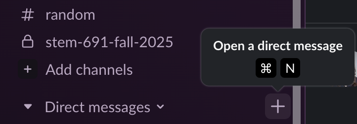
<br>
<br>
- **Try it!** DM yourself in Slack or post in the class channel to see how backticks work in Slack. -->


# {PalmerPenguins} Scavenger Hunt

## Scavenger Hunt 1 of 2 {.smaller}
<hr>
- In the `week-2` folder you will find `palmer_penguins_scavenger_hunt.qmd`
- The `.qmd` file has instructions embedded.
- Everyone should have the .qmd file open and be ready to work together.
- One person should share their screen, but EVERYONE should contribute.
- This is not about getting the document finished; it's about the collaboration and talking through each step.
- ONLY 1 RENDERED (.html) should be submitted.
  - **That is, each person in the group should submit the same document. EACH member should submit!**
  - Slack is great to share the .html rendered file with the whole group (via DM, you can add multiple people)
- Make sure everyone's name is in author field!

## Scavenger Hunt 2 of 2 {.smaller}
<hr>
Breakout room structure:

- **Individual Think Time**: ~ 3 min (camera off / mute)
  - Review document
  - Review prompts
  - Start planning possible approaches/pseudocode
- **Introductions**: ~ 3 min (camera on/ unmute)
- **Collaborative Work** (camera on/unmute)

# Looking Ahead

## Looking Ahead
<hr>
- Week 2 Assignment
  - My First Data Visualization (maybe 2nd)
- Readings
  - **Work Through** Beck (n.d.)
  - **Skim** dplyr cheatsheet
  - **Skim** Wickham et al., (2023) [Optional/Advanced]

## Office Hours
<hr>
- By Appointment