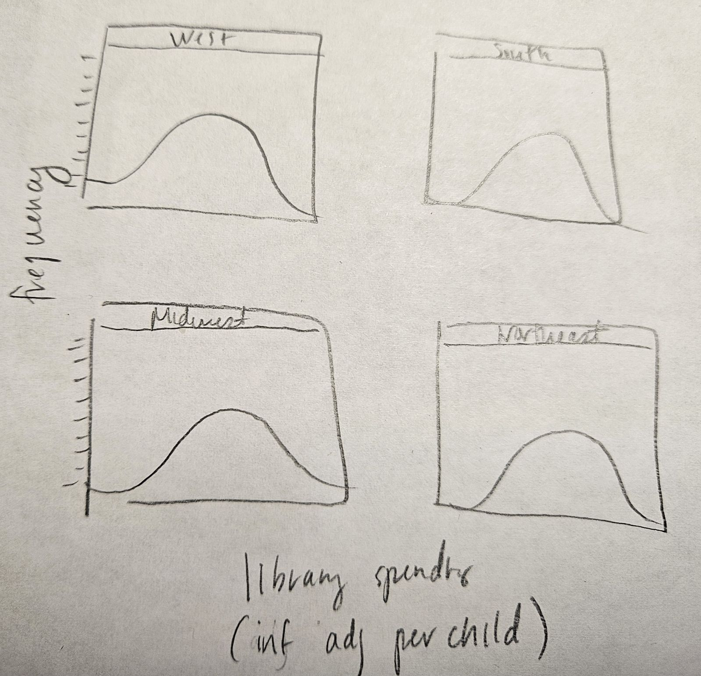

<!--Put everyone's name in the author field within the YAML header.-->

<!--Tidyverse is already installed. Load it in the setup chunk below. -->
```{r setup, include=FALSE}
knitr::opts_chunk$set(echo = TRUE)

library(tidyverse)
```

<!--Initial Cleanup: Read in the data and do any initial cleanup (i.e. delete row indices, janitor::clean_names())-->
```{r}
tidykids <- read_csv("tidykids.csv")|>
  select(-...1)|>
  janitor::clean_names()
```

### Research Question:
What is the *distribution* of inflation-adjusted per-child spending on libraries across *each* U.S. region in 2016? How do the regional distributions compare to the national mean?

**KEY:** 

- Some notes here... *distribution* = histogram or variation thereof
- *each* region = facet_wrap based on region

### Step 1: Draw a sketch. 

<!--You should be able to upload it using the `Upload` button in the file pane and then click `choose file`. Note: iPhone users may have trouble with this, given the iPhone photo file extension (screenshot should work!). You can also just share it on camera. Make sure you and your team agree on what plot you're trying to create. -->

<!-- The ![] is how you tell markdown you're inserting a photo - don't delete it! -->



### Step 2: Determine what `geom`s you will need to construct your plot. 
<!--Write them below.-->

Geoms needed:

1. `geom_histogram()`
2. `facet_wrap()` <- not really a geom, but a ggplot2 function

### Step 3: Determine what variables/data wrangling you need to do.
<!--Make a list so all members can see and agree on it. After you make the list, create as many code blocks as you want and wrangle your data!-->

Data / Data wrangling steps needed:

1. Filter the data to only include 2016
2. Filter for only the library spending observations
3. Create the region variable
4. Calculate the national mean (for the second question)

```{r filter_data_lib_16_create_region}
tidykids_lib16 <- tidykids |>
  filter(year == 2016 & variable == "lib") |>
  mutate(region = case_when(
    state %in% c("Maine", "New Hampshire", "Vermont", "Massachusetts", "Rhode Island", 
                 "Connecticut", "New York", "New Jersey", "Pennsylvania") ~ "Northeast",
    state %in% c("Ohio", "Indiana", "Illinois", "Michigan", "Wisconsin", "Minnesota",
                 "Iowa", "Missouri", "North Dakota", "South Dakota", "Nebraska",
                 "Kansas") ~ "Midwest",
    state %in% c("Delaware", "Maryland", "Virginia", "West Virginia", "North Carolina", 
                 "South Carolina", "Georgia", "Florida", "Kentucky", "Tennessee", 
                 "Alabama", "Mississippi", "Arkansas", "Louisiana", "Oklahoma",
                 "Texas", "District of Columbia") ~ "South",
    state %in% c("Montana", "Idaho", "Wyoming", "Colorado", "New Mexico", "Arizona", 
                 "Utah", "Nevada", "California", "Oregon", "Washington", "Hawaii",
                 "Alaska") ~ "West"
  ))
```

```{r calculate_national_mean}
national_mean <- tidykids_lib16 |>
  summarise(mean_spending = mean(inf_adj_perchild)) |>
  pull() # pull() is a dplyr function that extracts a single column from a data frame
```

### Step 4: Create the plot!

```{r}
tidykids_lib16 |>
  ggplot(aes(x = inf_adj_perchild)) +
  geom_histogram(binwidth = .05, fill = "skyblue", color = "black") + #Note: binwidth is adjusted, given the range of the inf_adj_perchild variable
  facet_wrap(~region) +
  labs(title = "Inflation-Adjusted Per-Child Spending on Libraries in 2016",
       x = "Inflation-Adjusted Per-Child Spending",
       y = "Count") +
  geom_vline(xintercept = national_mean, color = "red", linetype = "dashed")
```

<!--When complete, knit this document to HTML and submit on Canvas. Each person should be able to download the knitted .html file, so each person should also submit on Canvas.-->