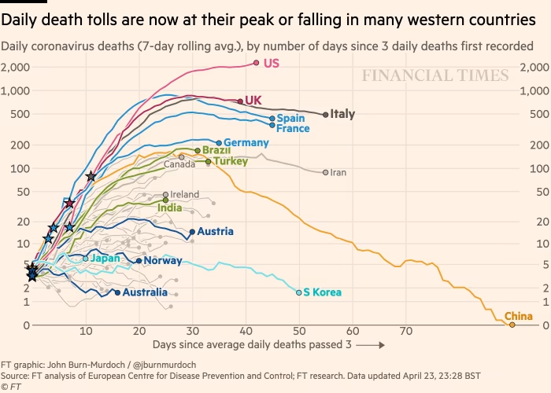

```{r xaringan-themer, include=FALSE, warning=FALSE}
library(xaringanthemer)

style_duo_accent(
  primary_color = "#FF8200",
  secondary_color = "#58595B",
  link_color = "blue",
  title_slide_text_color = "#222943",
  title_slide_background_color = "#ededed",
  title_slide_background_image = "https://brand.utk.edu/wp-content/uploads/2019/02/University-HorizRightLogo-RGB.png",
  title_slide_background_position = "bottom",
  title_slide_background_size = "30%"
)
```

```{r setup, include=FALSE}
knitr::opts_chunk$set(echo = FALSE, message = FALSE, warning = FALSE)
```

```{r, echo=FALSE}
# then load all the relevant packages
pacman::p_load(pacman, knitr, tidyverse, readxl)
```

```{r xaringanExtra-clipboard, echo=FALSE}
# these allow any code snippets to be copied to the clipboard so they 
# can be pasted easily
htmltools::tagList(
  xaringanExtra::use_clipboard(
    button_text = "<i class=\"fa fa-clipboard\"></i>",
    success_text = "<i class=\"fa fa-check\" style=\"color: #90BE6D\"></i>",
  ),
  rmarkdown::html_dependency_font_awesome()
)
```

```{r xaringan-panelset, echo=FALSE}
xaringanExtra::use_panelset()
```

# Purpose and Agenda

This week, we answer the following question: How do I visualize amounts?

## What we'll do in this presentation

- Example viz
- Recap
- Reading discussion highlights
- Key concept #1 - visualizing amounts
- Code-along: creating bar and column charts
- What’s next

---

## What do you notice? What do you wonder?



---

# Recap

- We focused on how to use ggplot2 in terms of a) `ggplot()`, b) `aes()`, and c) `geom_**()`
- Assignment:
  - Pretty open-ended! 
  - Wins and challenges to be discussed after the reading discussion
- Reading: Healy

---


---

# Reading Discussion

- Room 1: What is "tidy data"? Why is it important?
- Room 2: What do aesthetic mappings (`aes`) do? Provide an example of a mapping and an appropriate "geom" based on it.
- Room 3: How are layers added to a ggplot2 plot? Provide an example of 3 different layers from the chapter.
- Room 4: What is the difference between mapping and setting aesthetics?
- Room 5: What are some considerations for saving plots created with ggplot2?

*In breakout rooms, add one or more sticky notes summarizing your key discussion points here: https://jamboard.google.com/d/1TDObNOTCpJ-k-2R4eR2OFoib-SkMEASDdJUuMiz0Pxs/viewer*

*Elect one person to share that point with the whole group*

---

# Assignments wins and challenges

## Wins

## Challenges

---

# Key concept #1: Visualizing amounts

Key principles:

- Ensure you have the right data
- Make the labels readable
- Order bars in a logical manner
- Stack, dodge, or facet, when appropriate
- Theme to finish

---

## Ensure you have the right data:

- Data should be single values that represent *amounts*: a quantitative value for each category; often this requires using `count()` or `group_by()` and `summarize()`, first!
- If you have a _distribution_ of amounts, then a bar chart may not work

```{r, out.height="10%"}
knitr::include_graphics("https://clauswilke.com/dataviz/visualizing_amounts_files/figure-html/boxoffice-vertical-1.png")
```

---

## Make the labels readable

- A critical challenge with bar charts is that the labels of the categories are hard to read (or overlapping)
  
```{r, echo = FALSE, message = FALSE, warning = FALSE, fig.height=4}
library(tidyverse)
starwars %>% 
  count(eye_color) %>% 
  ggplot(aes(x = eye_color, y = n)) +
  geom_col()
```

- Two options: 1) Use `coord_flip()` to switch the _x_ and _y_ axes or 2) Rotate the axis labels (not typically recommended, but occasionally appropriate)

---

# Better!

```{r, echo = FALSE, message = FALSE, warning = FALSE, fig.height=4}
library(tidyverse)
starwars %>% 
  count(eye_color) %>% 
  ggplot(aes(x = eye_color, y = n)) +
  geom_col() +
  coord_flip()
```
---

## Order bars in a logical manner

- Often, the categories' default order is not helpful (or logical!)
- We can use `reorder()` to address this
  - FROM: `ggplot(aes(x = eye_color, y = n)) +`
  - TO: `ggplot(aes(x = reorder(eye_color, n), y = n)) +`

```{r, echo = FALSE, message = FALSE, warning = FALSE, fig.height=4}
library(tidyverse)
starwars %>% 
  count(eye_color) %>% 
  ggplot(aes(x = reorder(eye_color, n), y = n)) +
  geom_col() +
  coord_flip()
```

---

## Stack, dodge, or facet

= Stacking, dodging, and faceting are helpful ways of representing more than one amount per category
- Generally, these are appropriate for more representing more complex data that still involves amounts
- Stacking: Useful when the sum of the amounts represented by the individual stacked bars and the individual bars' values are of interest
- Dodging (grouping): Useful when we want to draw out comparisons for amounts within a category
- Faceting: Useful in similar cases as dodging; can be helpful when you have _many_ comparisons or categories

---

# Stacking

- `geom_col(position = "stack")`

```{r, out.height="10%"}
knitr::include_graphics("https://clauswilke.com/dataviz/visualizing_amounts_files/figure-html/titanic-passengers-by-class-sex-1.png")
```

---

# Dodging (grouping)

- `geom_col(position = "dodge")`

```{r, out.height="10%"}
knitr::include_graphics("https://clauswilke.com/dataviz/visualizing_amounts_files/figure-html/income-by-race-age-dodged-1.png")
```

---

# Faceting

- `geom_col() + facet_wrap(~)`

```{r, out.height="10%"}
knitr::include_graphics("https://clauswilke.com/dataviz/visualizing_amounts_files/figure-html/income-by-age-race-faceted-1.png")
```

---

## Theme to finish

```{r, echo = TRUE, eval = FALSE, message = FALSE, warning = FALSE, fig.height=6}
library(ggthemes)

data_to_plot <- starwars %>% 
  mutate(eye_color = as.factor(eye_color)) %>% 
  mutate(eye_color = fct_lump_min(eye_color,  min = 2)) %>% 
  count(eye_color)

data_to_plot %>% 
  ggplot(aes(x = reorder(eye_color, n), y = n)) +
  geom_col() +
  coord_flip() +
  labs(x = "Number of Characters", y = "Eye Color", 
       title = "Starwars Characters' Eye Colors") +
  theme_tufte() +
  theme(text = element_text(size = 16))
```

---

# Code-along


.panelset[


.panel[.panel-name[tidykids]

Let's use the tidykids data to start from scratch:

```{r, eval = FALSE}
tidykids <- read_csv("tidykids.csv")
```

- Ensure you have the right data: pick a state -- `filter()`
- Make the labels readable: `coord_flip()`
- Order bars in a logical manner: `reorder()`
- Stack, dodge, or facet, when appropriate: let's viz multiple states
- Theme to finish: pick a theme with ggthemes

]


.panel[.panel-name[starwars]

Let's start by working through the last plot, line-by-line

```{r, echo = TRUE, eval = FALSE}
library(tidyverse)
library(ggthemes)

data_to_plot <- starwars %>% 
  mutate(eye_color = as.factor(eye_color)) %>% 
  mutate(eye_color = fct_lump_min(eye_color,  min = 2)) %>% 
  count(eye_color)

data_to_plot %>% 
  ggplot(aes(x = reorder(eye_color, n), y = n)) +
  geom_col() +
  coord_flip() +
  labs(x = "Number of Characters", y = "Eye Color", 
       title = "Starwars Characters' Eye Colors") +
  theme_tufte() +
  theme(text = element_text(size = 16))
```

]

.panel[.panel-name[heatmap]

Let's create a heatmap using tidykids data for PK12ed spending across states

]


]

---

# What's next?

.pull-left[

## Readings

**[Healy, Chapter 6](https://clauswilke.com/dataviz/visualizing-amounts.html#dot-plots-and-heatmaps)**
**Optional: [Healy, Chapter 2](https://clauswilke.com/dataviz/visualizing-amounts.html#dot-plots-and-heatmaps)

*both linked in Canvas*

]
.pull-right[

## Assignments/Tasks

**Assignment 5: Visualizing amounts**
  - Using tidykids again due to familiarity

]

---

# Check out

- What's one thing you took away from today?
- What's one thing you want to learn more about?
