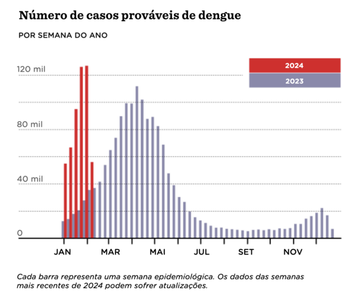
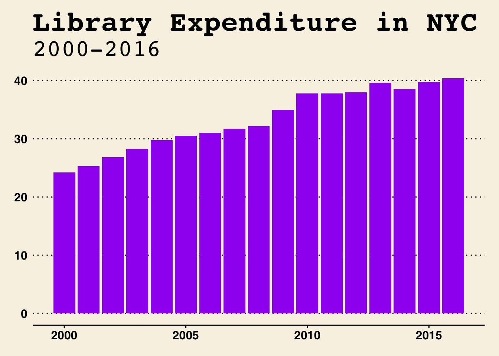
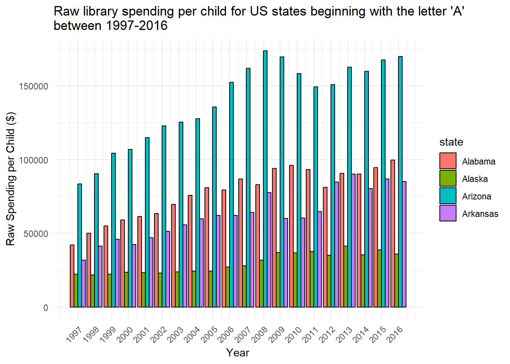
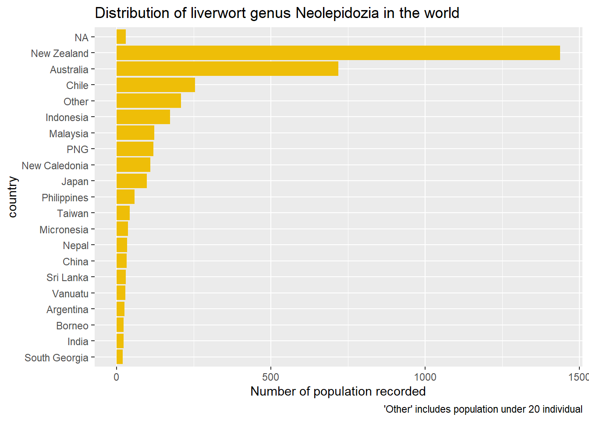

```{r xaringan-themer, include=FALSE, warning=FALSE}
library(xaringanthemer)

style_duo_accent(
  primary_color = "#FF8200",
  secondary_color = "#58595B",
  link_color = "blue",
  title_slide_text_color = "#222943",
  title_slide_background_color = "#ededed",
  title_slide_background_image = "https://brand.utk.edu/wp-content/uploads/2019/02/University-HorizRightLogo-RGB.png",
  title_slide_background_position = "bottom",
  title_slide_background_size = "30%"
)
```

```{r setup, include=FALSE}
knitr::opts_chunk$set(echo = TRUE, message = FALSE, warning = FALSE)
```

```{r, echo=FALSE}
# then load all the relevant packages
pacman::p_load(pacman, knitr, tidyverse, readxl)
```

```{r xaringanExtra-clipboard, echo=FALSE}
# these allow any code snippets to be copied to the clipboard so they 
# can be pasted easily
htmltools::tagList(
  xaringanExtra::use_clipboard(
    button_text = "<i class=\"fa fa-clipboard\"></i>",
    success_text = "<i class=\"fa fa-check\" style=\"color: #90BE6D\"></i>",
  ),
  rmarkdown::html_dependency_font_awesome()
)
```

```{r xaringan-panelset, echo=FALSE}
xaringanExtra::use_panelset()
```

# Purpose and Agenda

This week, we answer the following question: How do I visualize amounts?

## What we'll do in this presentation

- Sample graph
- Key concept #1 - Histograms
- Key concept #2 - Points
- Key concept #3 - Which graph to choose when?
- Code-along - 
- What's next
  - Assignment
  - Readings

---

## What do you think . . . 

is a positive feature of this graph?
is a negative feature



---

# Recap

- We focused on creating column (or bar charts):
  - "standard"
  - dodged
  - stacked
  - and faceted
- We discussed some principles for creating effective bar chart 
- Assignment:
  - You created a variety of bar charts using tidykids (for the last time!)
- Reading: Healy's [chapter on different types of bar charts](https://clauswilke.com/dataviz/visualizing-amounts.html)

---

## Assignment recap



---

## Assignment recap



---

## Assignment recap



---

# Key concept #1: Histograms

## Histograms and other distributions

What do you think the following graphs show?

.pull-left[

```{r, include = FALSE}
library(palmerpenguins)
```

```{r, fig.height=5}
hist(penguins$body_mass_g)
```


]

.pull-right[

```{r, fig.height=5}
boxplot(penguins$body_mass_g)
```

]
---
# The classics

Wait...where is `ggplot`?

<!-- Students may not have seen some of base R's plot functions. Now is a good chance to introduce these two and what the $ means.

Reference: https://bookdown.org/rdpeng/exdata/the-base-plotting-system-1.html
-->

.pull-left[

```{r, fig.height=5}
hist(penguins$body_mass_g)
```


]

.pull-right[

```{r, fig.height=5}
boxplot(penguins$body_mass_g)
```

]

---

# The classics

.pull-left[

```{r, fig.height=5}
ggplot(penguins, aes(x=body_mass_g))+
  geom_histogram(binwidth = 200)
```


]

.pull-right[

```{r, fig.height=5}
ggplot(penguins, aes(y=body_mass_g))+
  geom_boxplot()
```

]


---

# A (relative) newcomer

```{r, fig.height = 5}
ggplot(penguins, aes(x=body_mass_g))+
  geom_density()
```

---

# Histograms vs. Density plots

.pull-left[

### Histograms

- How it works: *bin* and count observations
- Key consideration: How many bins (defaults are often but not always suitable)
- Historically important, but somewhat replaced by newer techniques

]

.pull-right[

### Density plots

- How it works: uses fancy math to _estimate_ a curve that represents the distribution of the data
- Key consideration: avoiding representing made-up data points
- Can be a little hard to straightforwardly interpret

]

---

# Multiple distributions: Histograms and box plots

You can easily split out the plot with `fill`

.pull-left[

```{r, fig.height=5}
ggplot(penguins, aes(x=body_mass_g, fill=species))+
  geom_histogram(binwidth = 200, position = "identity", alpha=.6)
```


]

.pull-right[

```{r, fig.height=5}
ggplot(penguins, aes(y=body_mass_g, fill=species))+
  geom_boxplot()
```

]

---

# Multiple plots; Overlapping densities

*set alpha*

```{r, fig.height = 5}
ggplot(penguins, aes(x=body_mass_g, fill=species))+
  geom_density(alpha = .25)
```

---

# Multiple plots; Violin plots

```{r, fig.height = 5}
ggplot(penguins, aes(x = species, y=body_mass_g))+
  geom_violin()
```

---

# Density and Ridgeline Plots

Sometimes you want to know the shape of your distribution, but you do not want a histogram.

```{r, fig.height=2}
ggplot(penguins, aes(x=body_mass_g))+
  geom_density()
```

Note:
Plotting a histogram and density curve together takes a bit more work:


```{r echo=FALSE, fig.height=2}
ggplot(penguins, aes(x=body_mass_g))+
geom_histogram(binwidth=100, colour="black", 
               aes(y=..density..))+
stat_function(fun=dnorm,
                         color="red",
                         args=list(mean=mean(penguins$body_mass_g,
                                             na.rm=TRUE), 
                                   sd=sd(penguins$body_mass_g,
                                         na.rm=TRUE)))

```

---
# Ridgeline Plots

We can easily get a bit fancier with the `ggridges` package:

```{r, fig.height=5}
library(ggridges)
ggplot(penguins, aes(x=body_mass_g, y=island))+
  geom_density_ridges()
```

---
# Ridgeline Plots

How can ridgeline plots be useful?

Imagine a **long** dataset like this:

```{r}
penguins_long <- penguins %>%
  rownames_to_column("id") %>%
  pivot_longer(bill_length_mm:body_mass_g,
               names_to="stat_type", values_to="stat")
```

```{r, fig.height=3}
ggplot(penguins_long, aes(x=stat, y=stat_type))+
  geom_density_ridges()
```

---

# Key concept #2: Scatterplots

Scatterplots are quite simple to create in R. For today's examples, we will again use the `palmerpenguin` package and its `penguins` data set.


```{r include=FALSE}
library(palmerpenguins)
```

---


# Scatterplots in R

Scatterplots are quite simple to create in R. For today's examples, we will use the `palmerpenguin` package and its `penguins` data set, which contains measurements for different penguins in Antarctica.


```{r include=FALSE}
library(palmerpenguins)
```

---


First, we can use base R to simply plot all the data in a *scatterplot matrix*

```{r fig.width=8, fig.height=5}
plot(penguins)
```

This is not super useful, however.

---
# Scatterplots in R

We can make a bivariate (two-variable) scatterplot using `geom_point()`.


```{r fig.width=8, fig.height=3}
penguins %>%
  ggplot(aes(x=flipper_length_mm, y=body_mass_g))+
  geom_point()
```

---

# Scatterplots in R

We can change the color of all dots simply with `color = `


```{r fig.width=8, fig.height=3}
penguins %>%
  ggplot(aes(x=flipper_length_mm, y=body_mass_g))+
  geom_point(color="skyblue")
```

---

# Scatterplots in R

We can map the color to the penguin species by using `color` inside of `aes`


```{r fig.width=8, fig.height=3}
penguins %>%
  ggplot(aes(x=flipper_length_mm, y=body_mass_g,
             color=species))+
  geom_point()
```

---
# Scatterplots in R

We can also map the *shape* to a variable using `shape`


```{r fig.width=8, fig.height=3}
penguins %>%
  ggplot(aes(x=flipper_length_mm, y=body_mass_g,
             color=species, shape=sex))+
  geom_point()
```

---
# Scatterplots in R

We can separate this out by island using `facet_wrap`. This allows us to see very  clear relationships between flipper length and body mass.


```{r fig.width=8, fig.height=3}
penguins %>%
  ggplot(aes(x=flipper_length_mm, y=body_mass_g,
             color=species, shape=sex))+
  geom_point()+
  facet_wrap(~island, nrow=1)
```

---
# Scatterplots in R

All of the colors and shapes can be controlled using `scale_color_manual` and `scale_shape_manual`. See list of shapes [here](https://ggplot2.tidyverse.org/articles/ggplot2-specs.html#polygons).

.pull-left[

```{r echo=TRUE, eval=FALSE}
penguins %>% 
  ggplot(aes(x = flipper_length_mm, y = body_mass_g,
             color=species, shape=species)) +
  geom_point(size = 3,alpha = 0.8) +
  scale_color_manual(values = c("Adelie" = "darkorange",
                                "Chinstrap" = 
  "purple","Gentoo" = "cyan4")) +
  scale_shape_manual(values = c("Adelie" = 17,"Chinstrap" = 19,
                                "Gentoo" = 18))
```

]

.pull-right[

```{r fig.width = 8, fig.height=4, echo=FALSE}
penguins %>% 
  ggplot(aes(x = flipper_length_mm, y = body_mass_g,
             color=species, shape=species)) +
  geom_point(size = 3,alpha = 0.8) +
  scale_color_manual(values = c("Adelie" = "darkorange",
                                "Chinstrap" = 
  "purple","Gentoo" = "cyan4")) +
  scale_shape_manual(values = c("Adelie" = 17,
                                "Chinstrap" = 19,
                                "Gentoo" = 18))
```

]
---

# Scatterplots in R

Scatterplots often are useful for **correlations**. It is possible to display not only the correlation but the slope of a line for each scatterplot. We can add the correlation coefficient with `ggpubr::stat_cor()` and the regression line with `geom_smooth()`

```{r include=FALSE}
library(ggpubr)
```


```{r echo=TRUE, eval=FALSE}
penguins %>% 
  ggplot(aes(x = flipper_length_mm, y = body_mass_g,
             color=species, shape=species)) +
  geom_point(size = 3,alpha = 0.8) +
  stat_cor()+
  geom_smooth(method="lm")+
  scale_color_manual(values = c("Adelie" = "darkorange",
                                "Chinstrap" = 
  "purple","Gentoo" = "cyan4")) +
  scale_shape_manual(values = c("Adelie" = 17,"Chinstrap" = 19,
                                "Gentoo" = 18))
```

---

# Scatterplots in R


```{r fig.width = 8, fig.height=4, echo=FALSE}
penguins %>% 
  ggplot(aes(x = flipper_length_mm, y = body_mass_g,
             color=species, shape=species)) +
  geom_point(size = 3,alpha = 0.8) +
  stat_cor()+
  geom_smooth(method="lm")+
  scale_color_manual(values = c("Adelie" = "darkorange",
                                "Chinstrap" = 
  "purple","Gentoo" = "cyan4")) +
  scale_shape_manual(values = c("Adelie" = 17,"Chinstrap" = 19,
                                "Gentoo" = 18))
```

---
# Scatterplots in R

We can make a bivariate (two-variable) scatterplot using `geom_point()`.


```{r fig.width=8, fig.height=3}
penguins %>%
  ggplot(aes(x=flipper_length_mm, y=body_mass_g))+
  geom_point()
```

---

# Scatterplots in R

We can change the color of all dots simply with `color = `


```{r fig.width=8, fig.height=3}
penguins %>%
  ggplot(aes(x=flipper_length_mm, y=body_mass_g))+
  geom_point(color="skyblue")
```

---

# Scatterplots in R

We can map the color to the penguin species by using `color` inside of `aes`


```{r fig.width=8, fig.height=3}
penguins %>%
  ggplot(aes(x=flipper_length_mm, y=body_mass_g,
             color=species))+
  geom_point()
```

---
# Scatterplots in R

We can also map the *shape* to a variable using `shape`


```{r fig.width=8, fig.height=3}
penguins %>%
  ggplot(aes(x=flipper_length_mm, y=body_mass_g,
             color=species, shape=sex))+
  geom_point()
```

---
# Scatterplots in R

We can separate this out by island using `facet_wrap`. This allows us to see very  clear relationships between flipper length and body mass.


```{r fig.width=8, fig.height=3}
penguins %>%
  ggplot(aes(x=flipper_length_mm, y=body_mass_g,
             color=species, shape=sex))+
  geom_point()+
  facet_wrap(~island, nrow=1)
```

---
# Scatterplots in R

All of the colors and shapes can be controlled using `scale_color_manual` and `scale_shape_manual`. See list of shapes [here](https://ggplot2.tidyverse.org/articles/ggplot2-specs.html#polygons).

```{r echo=TRUE, eval=FALSE}
penguins %>% 
  ggplot(aes(x = flipper_length_mm, y = body_mass_g,
             color=species, shape=species)) +
  geom_point(size = 3,alpha = 0.8) +
  scale_color_manual(values = c("Adelie" = "darkorange",
                                "Chinstrap" = 
  "purple","Gentoo" = "cyan4")) +
  scale_shape_manual(values = c("Adelie" = 17,"Chinstrap" = 19,
                                "Gentoo" = 18))
```

---

# Scatterplots in R

```{r fig.width = 8, fig.height=4, echo=FALSE}
penguins %>% 
  ggplot(aes(x = flipper_length_mm, y = body_mass_g,
             color=species, shape=species)) +
  geom_point(size = 3,alpha = 0.8) +
  scale_color_manual(values = c("Adelie" = "darkorange",
                                "Chinstrap" = 
  "purple","Gentoo" = "cyan4")) +
  scale_shape_manual(values = c("Adelie" = 17,
                                "Chinstrap" = 19,
                                "Gentoo" = 18))
```

---

# Key concept #3

**Which `geom_` should I use for which purpose

- When to use columns or bars?
  - Visualizing amounts across categories
  - *Stacking*: Useful when the sum of the amounts represented by the bars if of interest
  - *Dodging* (grouping): Useful when we want to draw out comparisons within a category
  - *Faceting*: Useful in similar cases as dodging
- When to use points?
  - associations between x and y (and z)
  - certain amounts (when the bars are all similar lengths)
  - for time-related data
- When to use histograms, density plots, and the like?
  - to visualize the distribution of data
  - can also be used to visualize multiple distributions

---

# Code-along


.panelset[


.panel[.panel-name[college data]

Let's use a new data set: college completion rates (from the NCES)
- U.S News and World Report college rankings (from Reiter)

We will read both in in a new way - copy this code! Please download the `.xlsx` file from the week 6 module

```{r, eval = FALSE}
library(readxl) # install.packages("readxl")

rankings <- read_excel("US-News-Rankings-Universities-2020.xlsx")
```

]

.panel[.panel-name[rankings]

Let's use `rankings`` to generate histograms and points

```{r, eval = FALSE}
rankings
```

]

]

---

# What's next?

.pull-left[

## Readings

**[Healy, Chapter 7](https://clauswilke.com/dataviz/histograms-density-plots.html)**
**[Healy, Chapter 12](https://clauswilke.com/dataviz/visualizing-associations.html)**

*both linked in Canvas*

]
.pull-right[

## Assignments/Tasks

**Assignment 6: Visualizing points and distributions**
  - Using college completion and college rankings data

]

---

# Check out

- What's one thing you took away from today?
- What's one thing you want to learn more about?
