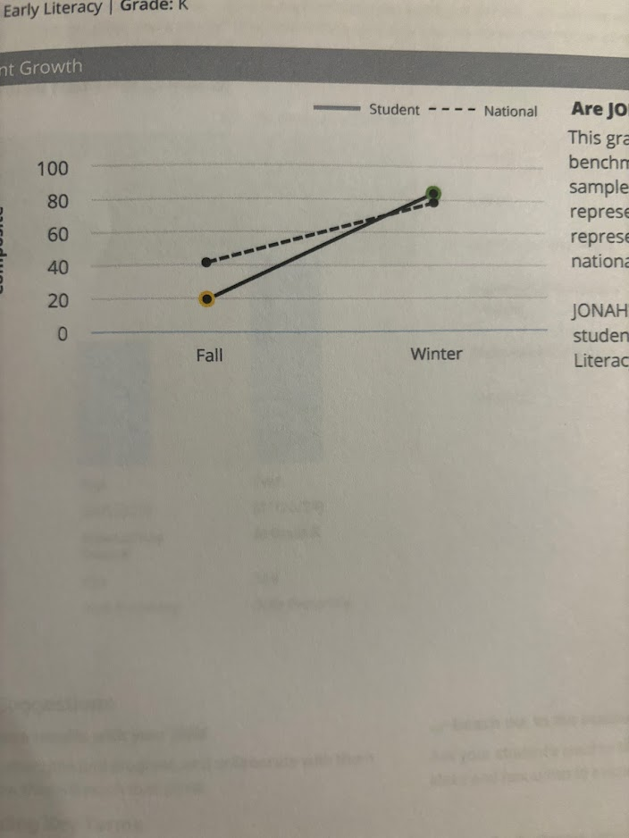
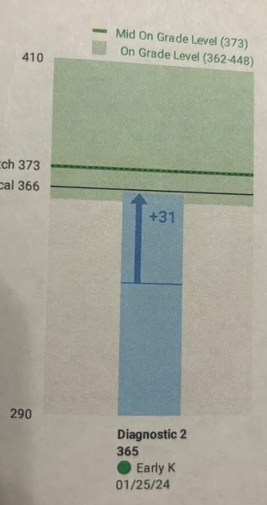
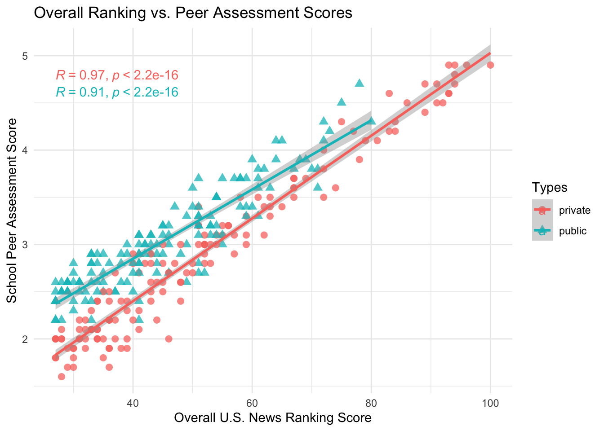
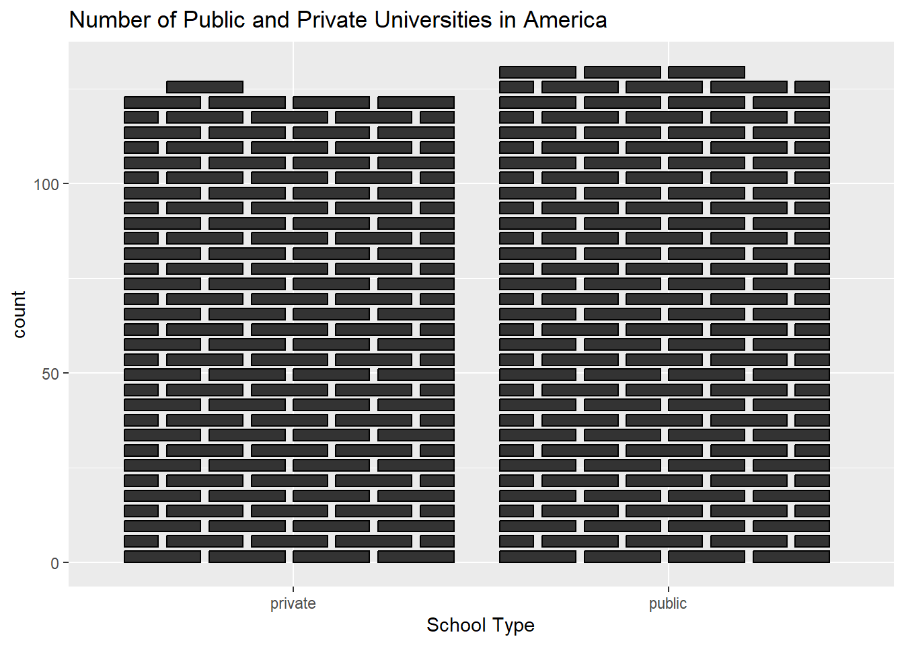
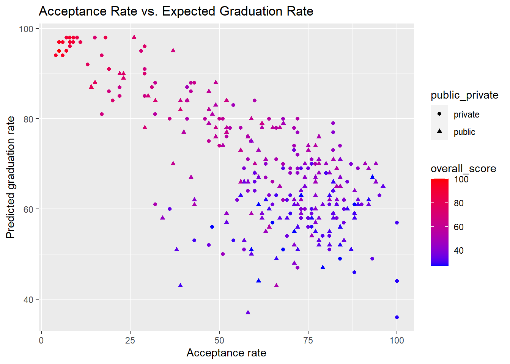
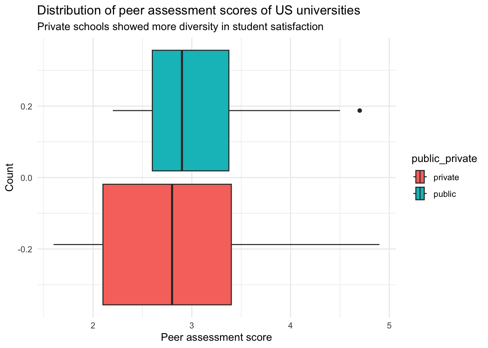

```{r xaringan-themer, include=FALSE, warning=FALSE}
library(xaringanthemer)

style_duo_accent(
  primary_color = "#FF8200",
  secondary_color = "#58595B",
  link_color = "blue",
  title_slide_text_color = "#222943",
  title_slide_background_color = "#ededed",
  title_slide_background_image = "https://brand.utk.edu/wp-content/uploads/2019/02/University-HorizRightLogo-RGB.png",
  title_slide_background_position = "bottom",
  title_slide_background_size = "30%"
)
```

```{r setup, include=FALSE}
knitr::opts_chunk$set(echo = TRUE, message = FALSE, warning = FALSE)
```

```{r, echo=FALSE}
# then load all the relevant packages
pacman::p_load(pacman, knitr, tidyverse, readxl)
```

```{r xaringanExtra-clipboard, echo=FALSE}
# these allow any code snippets to be copied to the clipboard so they 
# can be pasted easily
htmltools::tagList(
  xaringanExtra::use_clipboard(
    button_text = "<i class=\"fa fa-clipboard\"></i>",
    success_text = "<i class=\"fa fa-check\" style=\"color: #90BE6D\"></i>",
  ),
  rmarkdown::html_dependency_font_awesome()
)
```

```{r xaringan-panelset, echo=FALSE}
xaringanExtra::use_panelset()
```

# Purpose and Agenda

This week, we answer the following question: How and when do use lines and curves?

## What we'll do in this presentation

- Sample graph
- Recap
- Assignment recap
- Discussion summary
- Key concept #1 - Lines and curves
- Code-along
- Mini project
- Reflection/brief survey
- What's next: Mini project

---

## What do you think . . . 

is a positive feature of this graph?
is a negative feature



---

# Another (less effective)


---

# Recap

- We stepped back a bit and asked, which graph do we create when?
- We explored ways of visualizing distributions (histograms, density plots, boxplots, violin plots a bit) and scatter plots and their accoutrements
- You used a fairly complex dataset on U.S. news rankings

---

## Assignment recap



---

## Assignment recap



---

## Assignment recap


---

## Assignment recap



---

## Assignment recap



---

# Discussion summary

Which geom is best? It depends!

> The tidykids dataset could be represented in a variety of different visualizations. For example, a histogram would work to visualize the inflation adjusted amount per child that Tennessee spent on the Pell grant between 1997 and 2016. If we wanted to compare how much the inflation adjusted amount per child spent on the Pell grant was for different states in the south, we could create a density plot with different lines and shades for each state, showing the data over a range of years.

> When looking at multiple large datasets, such as the tree box plot shared by a classmate,  box-plots are extremely useful for comparing data distributions simultaneously.

---

# Key concept: Lines and curves

How could this chart be improved?


---

# Reading Discussion

How could this chart be improved?


---
# Time**lines**

Today we are going to talk about timeseries data and how to make time**lines** - line charts - from them. 
In addition, we will look at how to make area charts and how to make line charts when there are multiple groups.

---
# Time**lines**

## Overall principles 

1. Connecting lines can visually connect individual data points that have a temporal pattern
2. Fitted lines can show the more general trend over time
3. You can add a variety of fitted lines, including linear, quadratic, and smooth lines and curves
4. When you add lines, you don't always need to add points
5. With multiple groups, lines are nearly essential

Let's dive in, illustrate, and practice

---

# Time**lines**

Consider that we already know how to graph timeseries data with `geom_col()` and `geom_point`:

```{r include=FALSE}
data <- data.frame(y=c(4.8,5.1,4.9,4.8,5.2,5.2,5.3,5.4,5.1,5.5)*10000, x=seq(2010,2019,1)) 
```

.pull-left[
```{r, fig.height=4}
data %>%
  ggplot(aes(x=as.factor(x), y=y))+
  geom_col()
```

]

.pull-right[
```{r, fig.height=5}
data %>%
  ggplot(aes(x=as.factor(x), y=y))+
  geom_point()
```

]

---
# Time**lines**

How could we add lines to these points?

Hint: Remember, ggplots are built in layers:

```{r, fig.height=4, echo = FALSE, eval = TRUE}
data %>%
  ggplot(aes(x=as.factor(x), y=y, group=1))+
  geom_point()
```

---
# Time**lines**

Voila!

```{r, fig.height=6, echo = FALSE, eval = TRUE}
data %>%
  ggplot(aes(x=as.factor(x), y=y, group=1))+
  geom_line()+
  geom_point()
```

---
# Time**lines**

We can easily make this into an area chart, too. However, note that `geom_area` acts like a bar or column - it uses the fill aesthetic *AND* it starts at a zero baseline, which may elide important differences between data points. 

.pull-left[

```{r, fig.height=3}
data %>%
  ggplot(aes(x=as.factor(x), y=y, group=1))+
  geom_area()+
  geom_point()
```

]

.pull-right[
```{r, fig.height=3}
data %>%
  ggplot(aes(x=as.factor(x), y=y, group=1))+
  geom_line()+
  geom_area(alpha=.3)+
  coord_cartesian(ylim=
                    c(45000,56000))

```
]

---

# Timelines With Many Groups

```{r echo=FALSE}
phd_field <- readr::read_csv("https://raw.githubusercontent.com/rfordatascience/tidytuesday/master/data/2019/2019-02-19/phd_by_field.csv")

phd_field %>%
  group_by(major_field, year) %>%
  summarize(n = sum(n_phds, na.rm=TRUE)) %>%
  ggplot(aes(x=as.factor(year),
             y=n,
             color=major_field))+
  geom_line(aes(group=major_field)) +
  theme(legend.position = "none")
```


---

# Curves

- A critical difference is between *connecting* lines and *fitted* lines, or curves

- *Connecting line*: Connects the points (slide 17 as one of several examples)
- *Fitted lines*: Can take different forms: linear, quadratic, interpolated using fancy math

---

```{r}
data %>% 
  ggplot(aes(x = x, y = y)) +
  geom_smooth(method = "lm", se = FALSE) + # often helpful
  geom_point()
```

---

```{r}
data %>% 
  ggplot(aes(x = x, y = y)) +
  # fits quadratic curve using linear regression
  geom_smooth(method = "lm", formula = y ~ poly(x, 2), se = FALSE) + 
  geom_point()
```

---

```{r}
data %>% 
  ggplot(aes(x = x, y = y)) +
   # by default, uses a flexible way to create a smooth curve 
  geom_smooth(se = FALSE) +
  geom_point()
```
 
---

# Overall principles 

1. Connecting lines can visually connect individual data points that have a temporal pattern
2. Fitted lines can show the more general trend over time
3. You can add a variety of fitted lines, including linear, quadratic, and smooth lines and curves
4. When you add lines, you don't always need to add points
5. With multiple groups, lines are nearly essential

---

# Code-along


.panelset[


.panel[.panel-name[rankings data]

We'll use the **U.S News and World Report college rankings data** (from Reiter)

We will read this in a new way - copy this code! Please download the `.xlsx` file. 

Let's first look at it.

]

.panel[.panel-name[2020 data prep]

Let's work together through `2020-us-news-prep.R`

]

.panel[.panel-name[single ranking]

Let's create a visualization of a single schools' ranking:
  - Connected lines
  - Fitted lines

]

.panel[.panel-name[several rankings]

Let's create a visualization of several schools' ranking:
  - Connected lines
  - Fitted lines
  - Top 25

]

]

---

# What's next?

## Assignments/Tasks

**Mini Project #1** - due the Friday after we return from spring break (3/22 @ 11:59 pm)

---

# Reflection/brief survey

- [Syllabus](https://docs.google.com/document/d/1HjOQ9Pgkg4JSQhgUX8NGjX6hJIHyOE9Q/edit#heading=h.y5e0ybp1dm8j)
- Survey (2-3 min. max): https://forms.gle/dQMQGu6Hr9kevqMq7
- A brief reflection:
  - In my first or second year, emailed my department chair asking for a letter of recommendation 2-3 days before it was needed
  - She said: no big deal! It happens to all of us
  - Planfulness and restfulness are good, but sometimes life happens and we have to do our best
  - I appreciate you doing your best, sharing input with me, and me trying my best

---

# Check out

- What's one thing you took away from today?
- What's one thing you want to learn more about?
