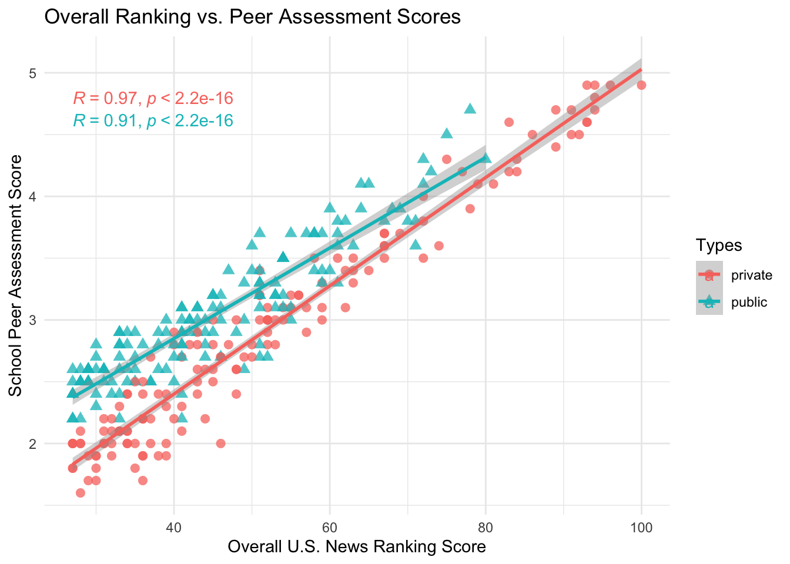
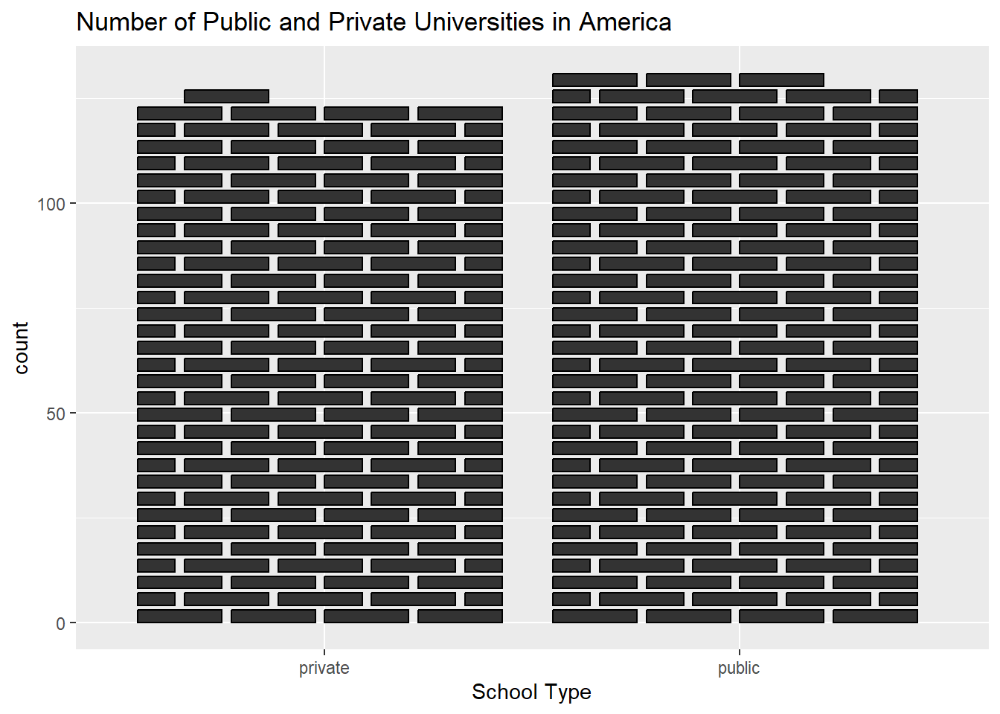

```{r xaringan-themer, include=FALSE, warning=FALSE}
library(xaringanthemer)

style_duo_accent(
  primary_color = "#FF8200",
  secondary_color = "#58595B",
  link_color = "blue",
  title_slide_text_color = "#222943",
  title_slide_background_color = "#ededed",
  title_slide_background_image = "https://brand.utk.edu/wp-content/uploads/2019/02/University-HorizRightLogo-RGB.png",
  title_slide_background_position = "bottom",
  title_slide_background_size = "30%"
)
```

```{r setup, include=FALSE}
knitr::opts_chunk$set(echo = TRUE, message = FALSE, warning = FALSE)
```

```{r, echo=FALSE}
# then load all the relevant packages
pacman::p_load(pacman, knitr, tidyverse, readxl)
```

```{r xaringanExtra-clipboard, echo=FALSE}
# these allow any code snippets to be copied to the clipboard so they 
# can be pasted easily
htmltools::tagList(
  xaringanExtra::use_clipboard(
    button_text = "<i class=\"fa fa-clipboard\"></i>",
    success_text = "<i class=\"fa fa-check\" style=\"color: #90BE6D\"></i>",
  ),
  rmarkdown::html_dependency_font_awesome()
)
```

```{r xaringan-panelset, echo=FALSE}
xaringanExtra::use_panelset()
```

# Purpose and Agenda

This week, we answer the following question: How and when do use lines and curves?

## What we'll do in this presentation

- Sample graph
- Recap
- Assignment recap
- Discussion summary
- Key concept #1 - Lines and curves
- Code-along
- Mini project
- Reflection/brief survey
- What's next: Mini project

---

## What do you think . . . 

is a positive feature of this graph?
is a negative feature


---

# Recap

- 

---

## Assignment recap



---

## Assignment recap



---

## Assignment recap


---

- Discussion summary

---

# Key concept: Lines and curves

---

# Code-along


.panelset[


.panel[.panel-name[college data]

Let's use a new data set: college completion rates (from the NCES)
- U.S News and World Report college rankings (from Reiter)

We will read both in in a new way - copy this code! Please download the `.xlsx` file from the week 6 module

```{r, eval = FALSE}
library(readxl) # install.packages("readxl")

rankings <- read_excel("US-News-Rankings-Universities-2020.xlsx")
```

]

.panel[.panel-name[rankings]

Let's use `rankings`` to generate histograms and points

```{r, eval = FALSE}
rankings
```

]

]

---

# What's next?

## Assignments/Tasks

**Mini Project #1


---

# Check out

- What's one thing you took away from today?
- What's one thing you want to learn more about?
